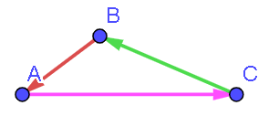

# Ejercicio 06 - Vectores

**Fecha:** 10-02-2026
**Estado:** 🟢 Resuelto solo

## Consigna

1. ¿Pueden combinarse dos vectores que tengan diferentes módulos para dar una resultante de cero? ¿Y tres vectores?
2. ¿Puede ser el módulo de la diferencia entre dos vectores mayor que el módulo de cualquiera de ellos? ¿Puede ser mayor que el módulo de su suma? En caso afirmativo muestre uno o más ejemplos; si la respuesta es negativa, justifique por qué.
3. ¿Tienen unidades los vectores unitarios $\hat{i}$, $\hat{j}$ y $\hat{k}$?

## Resolución

### Parte 1

- ¿Pueden combinarse dos vectores que tengan diferentes módulos para dar una resultante de cero? ¿Y tres vectores?

Para que la suma de vectores resulte en el vector nulo, necesitamos que el punto de partida sea el mismo que el de llegada. Pensaremos ambas las posibilidades con el método gráfico para sumar vectores.

Para el caso de dos vectores, es claro que la única forma de que el método gráfico nos devuelva al punto de partida al sumar, es que el segundo vector sea el opuesto del primero, por lo tanto, la respuesta a la primer pregunta es **NO**, no se pueden combinar dos vectores con diferentes módulos para obtener el vector nulo.

Por otra parte, el caso de tres vectores no funciona igual, veamos el siguiente ejemplo que prueba que **SI**, efectivamente se pueden combinar tres vectores con diferentes módulos para obtener el vector nulo.

### Parte 2

- ¿Puede ser el módulo de la diferencia entre dos vectores mayor que el módulo de cualquiera de ellos? ¿Puede ser mayor que el módulo de su suma? En caso afirmativo muestre uno o más ejemplos; si la respuesta es negativa, justifique por qué.

Quizás el camino más rápido para verificar esto es el método analítico. Consideremos dos vectores y empecemos estudiando el caso de la diferencia entre ellos.

- $\vec{v}=(2,2)$
- $\vec{w}=(-2,-2)$

Por lo tanto, la diferencia es la siguiente:

- $\vec{v}-\vec{w}=(2,2)-(-2,-2)=(4,4)$

Ahora calculemos todos los módulos y verifiquemos si alguno de los módulos de $\vec{v}$ y $\vec{w}$ son mayores que el módulo de la diferencia:

- $|v|=\sqrt{2^2+2^2}=\sqrt{8}$
- $|w|=\sqrt{(-2)^2+(-2)^2}=\sqrt{8}$
- $|v-w|=\sqrt{4^2+4^2}=\sqrt{32}$

Entonces el módulo de $\vec{v}-\vec{w}$ es mayor que el módulo de ambos $\vec{v}$ y $\vec{w}$ por separado.

Por otra parte, en ese mismo ejemplo vemos que el módulo de la diferencia de $\vec{v}$ y $\vec{w}$ es mayor que el módulo de la suma entre ellos, que devuelve el vector nulo.

### Parte 3

- ¿Tienen unidades los vectores unitarios $\hat{i}$, $\hat{j}$ y $\hat{k}$?

No, los vectores unitarios se utilizan para representar direcciones. Las unidades que se utilizan en los cálculos van en los escalares que van junto a los vectores unitarios. Es decir si $\vec{v}=v_x\hat{i}+v_y\hat{j}+v_z\hat{k}$, las unidades están con los escalares $v_x,v_y$ y $v_z$.