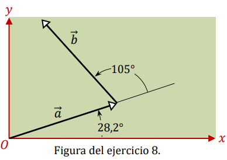

# Ejercicio 08 - Vectores

**Fecha:** 11-02-2026
**Estado:** 🟢 Resuelto solo

## Consigna

Dos vectores $\vec{a}$ y $\vec{b}$ tienen módulos iguales de $12.7$ unidades.  
Están orientados como se muestra en la figura y su suma es $\vec{r}$.

Halle las componentes $x$ e $y$ de $\vec{r}$, su módulo y el ángulo que forma con el eje $+x$.

## Resolución

Podemos hallar directamente las coordenadas de los vectores mostrados en la imagen, para $\vec{a}$ ya tenemos todos los datos, mientras que para $\vec{b}$ nos falta el ángulo, que está dado por:

- $105+28.2^{\circ}=133^{\circ}$

Ahora si, podemos operar para obtener las componentes de los vectores que están en juego.

- $a_x=12.7\cdot\cos(28.2^{\circ})\approx11.2$
- $a_y=12.7\cdot\sin(28.2^{\circ})\approx6.00$
- $b_x=12.7\cdot\cos(133^{\circ})\approx-8.66$
- $b_y=12.7\cdot\sin(133^{\circ})\approx9.29$

Por lo tanto, el vector $\vec{r}$ está dado por:

- $\vec{r}\approx(11.2,6.00)+(-8.66,9.29)=(2.54,15.3)$
- $|r|\approx\sqrt{2.54^2+15.3^2}\approx15.5$
- $\theta\approx\arctan(\frac{15.3}{2.54})\approx 80.6^{\circ}$