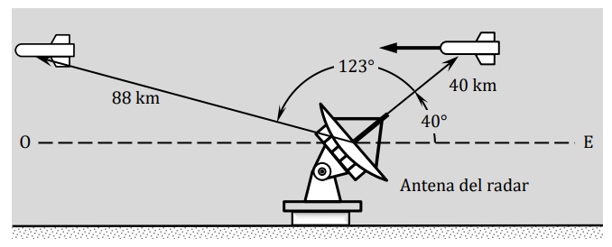

# Ejercicio 07 - Vectores

**Fecha:** 11-02-2026
**Estado:** 🟢 Resuelto solo

## Consigna

Una estación de radar detecta un cohete que se aproxima desde el este.  
En el primer contacto, la distancia al cohete es de $40\ \text{km}$ a $40^\circ$ sobre el horizonte.

El cohete es rastreado durante otros $123^\circ$ en el plano este-oeste, siendo la distancia del contacto final de $88\ \text{km}$.

Halle el desplazamiento del cohete durante el período de contacto con el radar.

## Resolución

Lo primero que tenemos que entender para este ejercicio, es la definición del "desplazamiento". Esto es bastante sencillo, es el vector que parte desde la posición inicial y termina en la posición final del objeto.
Si ponemos nombres a las posiciones $\vec{p_f}$ y $\vec{p_i}$, entonces el desplazamiento está definido por $\Delta\vec{x}=\vec{p_f}-\vec{p_i}$.

Por lo tanto, en este caso es bastante fácil hallar el desplazamiento, basta con determinar bien la posición inicial y final, para hallar el módulo del vector desplazamiento.
Considerando la posición del radar como el origen, tenemos que:

- $p_{ix}=40km\cdot\cos(40^{\circ})\approx31$
- $p_{iy}=40km\cdot\sin(40^{\circ})\approx26$
- $p_{fx}=88km\cdot\cos(163^{\circ})\approx-84$
- $p_{fy}=88km\cdot\sin(163^{\circ})\approx26$

Por lo tanto, con esta información podemos calcular el vector desplazamiento:

- $\Delta\vec{p}\approx(-84,26)-(31,26)=(-115,0)$

Para finalizar, tenemos que obtener el módulo de $\Delta\vec{p}$, que en este caso es bastante sencillo pues $|p|=115$.

Por lo tanto el cohete se desplaza apróximadamente $115km$ desde la primer aparación en el radar hasta la última.