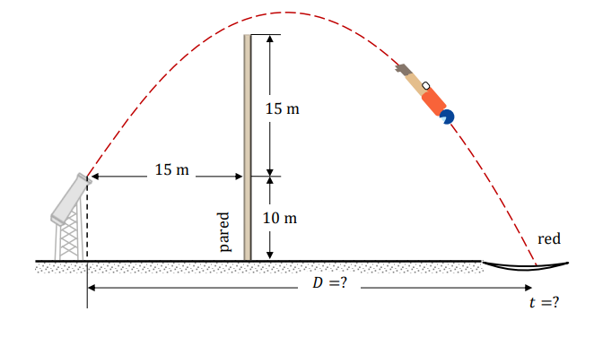

# Ejercicio 10 - Movimiento de proyectiles

**Fecha:** 30-03-2026
**Estado:** 🟢 Resuelto solo

## Consigna

En un circo, el hombre bala sale de un cañón y debe aterrizar en una red a $10{,}0m$ bajo la boca del cañón.

Si las componentes de su velocidad inicial son de $20{,}0m/s$ hacia arriba y de $10{,}0m/s$ en la horizontal:

1. ¿Cuánto tiempo permanece en el aire?
2. ¿Dónde debe estar la red?
3. ¿Supera la pared?

## Resolución

### Parte 1

- ¿Cuánto tiempo permanece en el aire?

Recordemos que:

- $x=x_0+{v_0}_xt+\frac{1}{2}a_xt^2\quad(*_1)$
- $y=y_0+{v_0}_yt+\frac{1}{2}a_yt^2\quad(*_2)$

Y cómo trabajamos con un movimiento de proyectil, tenemos que:

- $x_0=y_0=0$
- $a=-9{,}8\hat{j}m/s^2$

Con esto volvemos a las ecuaciones $*_1$ y $*_2$:

- $x={v_0}_xt\implies x=10m/s\cdot t$
- $y={v_0}_yt+\frac{1}{2}a_yt^2\implies y=20m/s\cdot t-4{,}9m/s^2\cdot t^2$

Esto nos da herramientas para atacar el problema, lo que queremos es saber el tiempo para el que el proyectil llega a la red, que está a una altura de $-10m$.
Entonces, queremos encontrar el $t$ para que:

- $-10m=20m/s\cdot t-4{,}9m/s^2\cdot t^2$

Entonces usando Bháskara:

$$
\begin{aligned}
&0=10m+20m/s\cdot t-4{,}9m/s^2\cdot t^2\\
&\iff\scriptstyle{(\text{Bháskara})}\\
&t=\frac{-20\pm\sqrt{400+196}}{-9{,}8}\\
&=\scriptstyle{(\text{operatoria})}\\
&t=\frac{-20\pm\sqrt{596}}{-9{,}8}\\
&=\scriptstyle{(\text{operatoria})}\\
&t\approx\frac{-20\pm24{,}4}{-9{,}8}\\
\end{aligned}
$$

Esto nos devuelve las soluciones $t_1\approx4{,}53$ y $t_2\approx-0{,}449$. Claramente la solución que tiene algún sentido físico es $t_1$, por lo que esa es la respuesta para esta parte.

### Parte 2

- ¿Dónde debe estar la red?

Esta parte es más sencilla por el trabajo que hicimos en la parte anterior. Sabemos el tiempo $t$ en el que va a estar llegando a la red, este siendo $t\approx 4{,}53$.
Entonces la solución será ver que $x$ nos devuelve la ecuación de $r_x$ para este tiempo, es decir:

- $x(4{,}53)=10m/s\cdot 4{,}53s\approx45m$

Por lo tanto la red debe estar centrada alrededor de $x=45m$.

### Parte 3

- ¿Supera la pared?

También es una pregunta bastante sencilla, mirando la figura tenemos que ver si cuando $x=15m$ la altura supera los $15m$ de altura.

Entonces primero hallamos el tiempo en el que el proyectil alcanza los $15m$ en el eje $x$:

- $15m=10m/s\cdot t$

De donde obtenemos que llega en un tiempo $t=1{,}5s$. Ahora podemos sustituir este valor en la ecuación de $r_y$ para este tiempo para determinar si supera la pared o no:

$$
\begin{aligned}
r_y(1{,}5)&=20m/s\cdot 1{,}5s-4{,}9m/s^2\cdot 1{,}5^2s^2\\
&=30m-11m\\
&=19m
\end{aligned}
$$

Por lo tanto, claramente supera la pared para este punto (está 4m por encima aproximadamente).