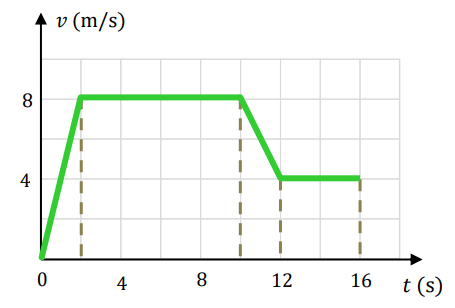

# Ejercicio 02 - Movimiento unidimensional

**Fecha:** 25-03-2026
**Estado:** 🟢 Resuelto solo

## Consigna

1. ¿Qué distancia recorre, en $16\ \text{s}$, el corredor cuya gráfica de velocidad en función del tiempo se muestra en la figura?
2. ¿Cuál es la aceleración del corredor en $t = 11\ \text{s}$?
3. ¿Cómo representaría la gráfica de la posición del corredor en función del tiempo? Y la de la aceleración?

## Resolución

### Parte 1

- ¿Qué distancia recorre, en $16\ \text{s}$, el corredor cuya gráfica de velocidad en función del tiempo se muestra en la figura?

Para responder esta pregunta hagamos la siguiente observación: si en un determinado intervalo, la función velocidad es la derivada de la función posición, entonces la posición que ocupa al final del intervalo el objeto es la integral en el mismo intervalo.
Con esto en mente, separemos cada tramo para estudiar el área bajo la curva de cada uno.

1. **Intervalo #1**. El área es un tríangulo, por lo tanto:
    - $i_1=\frac{8\cdot2}{2}=8$
2. **Intervalo #2**. El área es un rectángulo, por lo tanto:
    - $i_2=8\cdot8=64$
3. **Intervalo #3**. El área se puede separar en dos figuras. Consideremos dos figuras, un tríangulo y un rectángulo con respectivas áreas $A_t$ y $A_r$.
    - $i_3=A_t+A_r=\frac{4\cdot2}{2}+2\cdot4=12$
4. **Intervalo #4**. El área es un rectángulo, por lo tanto:
    - $i_4=4\cdot4=16$

Entonces, el área total es el sumando de todos los intervalos, es decir:

- $A=i_1+i_2+i_3+i_4=100\ \text{m}$

### Parte 2

- ¿Cuál es la aceleración del corredor en $t = 11\ \text{s}$?

Tengamos presente que la gráfica de la velocidad indica un decrecimiento *LINEAL* en el intervalo $[10,12]$ que incluye $t=11$, por lo tanto la aceleración debe ser negativa y constante en todo el intervalo. Por esto, $\overline{a}=a$, es decir que buscamos calcular la aceleración promedio para este intervalo.

- $a=\frac{\Delta v}{\Delta t}=\frac{-4}{2}=-2\ \text{m/s}$

### Parte 3

- ¿Cómo representaría la gráfica de la posición del corredor en función del tiempo? Y la de la aceleración?

Empezando por la gráfica de la posición, los tramos 1 y 3 tendrán una expresión cuadrática, mientras que los tramos 2 y 4 tendrán una expresión lineal..
Por otra parte, la gráfica de la aceleración tendrá un tramo constante positivo en el tramo 1, uno negativo en el tramo 3, mientras que los tramos 2 y 4 serán constantes en 0.
