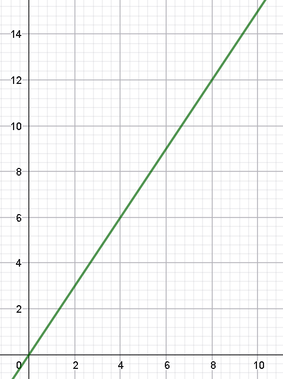
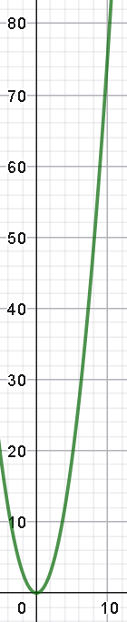

# Ejercicio 04 - Movimiento unidimensional

**Fecha:** 26-03-2026
**Estado:** 🟢 Resuelto solo

## Consigna

Un electrón que parte desde el reposo tiene una aceleración $a$ que aumenta linealmente con el tiempo $t$: $a=kt$ donde $k = 1{,}5\ \text{m/s}^3$.

1. Grafica $a$ en función de $t$ en los primeros $10\ \text{s}$.
2. A partir de la curva de la parte (a), grafica la velocidad en función de $t$ y calcula la velocidad instantánea $v$ del electrón $5\ \text{s}$ después de haber comenzado el movimiento.
3. A partir de la curva de la parte (b), grafica la posición $x$ en función de $t$ y calcula el desplazamiento del electrón durante los primeros $5\ \text{s}$ de su movimiento, suponiendo que $x(0) = 0$.

## Resolución

### Parte 1

- Grafica $a$ en función de $t$ en los primeros $10\ \text{s}$.

### Parte 2

- A partir de la curva de la parte (a), grafica la velocidad en función de $t$ y calcula la velocidad instantánea $v$ del electrón $5\ \text{s}$ después de haber comenzado el movimiento.

Como ya sabemos, para obtener la gráfica de la velocidad a partir de la función de la aceleración tenemos que integrar.

- $v(t)=\int a(t)dt=0{,}75\ \text{m/s}^3\cdot t^2 + C$

La pregunta natural es: qué hacemos con la constante? No hay forma de saber su valor a menos que tengamos un dato adicional en la letra.
Afortunadamente contamos con un dato que nos va a ayudar a determinar el valor de la constante de integración:

> "parte desde el reposo"

Por lo tanto, la velocidad inicial es $0$, y esto solo lo obtenemos con la constante $C=0$.

Concluimos que la función velocidad $v(t)$ es:

- $v(t)=0{,}75\ \text{m/s}^3\cdot t^2$

Y entonces la velocidad instantánea en $t=5$ es de $19\ \text{m/s}$ (redondeado por cifras significativas). Gráficamente la función $v(t)$ es:

### Parte 3

- A partir de la curva de la parte (b), grafica la posición $x$ en función de $t$ y calcula el desplazamiento del electrón durante los primeros $5\ \text{s}$ de su movimiento, suponiendo que $x(0) = 0$.

Muy similarmente a la parte anterior, queremos integrar la función $v(t)$.

- $x(t)=\int v(t)dt=0{,}25\ \text{m/s}^3\cdot t^3+C$

Nuevamente gracias al dato que nos brinda una parte de la pregunta, sabemos que $C=0$ y entonces:

- $x(t)=0{,}25\ \text{m/s}^3\cdot t^3$

Y entonces el desplazamiento durante los primeros $5\ \text{s}$ es $31\ \text{m}$.

La gráfica para esta función es sencilla al ser polinómica, pero es díficil crear una imágen para ilustrarla.