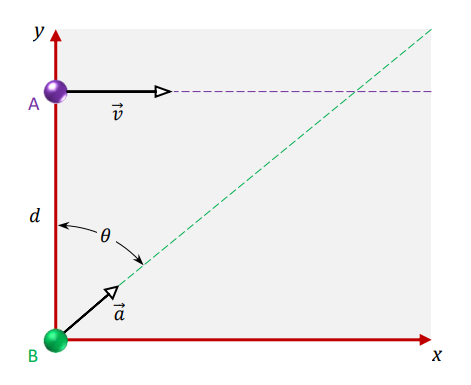

# Ejercicio 09 - Movimiento bidimensional

**Fecha:** 30-03-2026
**Estado:** 🟢 Resuelto solo

## Consigna

Una partícula $A$ se mueve a lo largo de la línea $y=d$ con $d=30m$ con una velocidad constante $\vec{v}$ ($v = 3{,}0\ \text{m/s}$) dirigida paralelamente al eje $x$.

Una segunda partícula $B$ comienza en el origen con velocidad cero y aceleración constante $\vec{a}$ ($a = 0{,}4\ \text{m/s}^2$) en el mismo instante en que la partícula $A$ pasa el eje $y$.

¿Qué ángulo $\theta$ entre $\vec{a}$ y el eje $y$ resultaría en una colisión entre estas dos partículas?

## Resolución

Escribamos de forma organizada los datos que tenemos para cada partícula:

**Partícula $A$:**

- $\theta_A=0$
- $|a_A|=0$
- $\vec{v_A}=3{,}0\hat{i}m/s$
- $\vec{r_A}_0=30\hat{j}m$

**Partícula $B$:**

- $\theta_B=\text{?}$
- $|a_B|=0{,}4m/s^2$
- $\vec{v_B}_0=0m/s$
- $\vec{r_B}_0=\begin{pmatrix}0&0\end{pmatrix}$

Intentemos calcular la función posición para cada partícula (por componente):

- ${r_A}_x(t)=0m+3{,}0m/s\cdot t$
- ${r_A}_y(t)=30m$
- ${r_B}_x(t)={r_{0x}}_B+{v_{0x}}_Bt+\frac{1}{2}a_xt^2=\frac{1}{2}a_xt^2$
- ${r_B}_y(t)=\frac{1}{2}a_yt^2$

Ahora, escribamos la aceleración por componentes:

- $\vec{a}=\begin{pmatrix}0{,}4\cos\theta&0{,}4\sin\theta\end{pmatrix}$

**OJO!** Con esto estamos considerando el ángulo con respecto al eje $x$, y nos piden el con respecto al eje $y$. Tendremos que operar cuando hallemos el ángulo, o alternativamente definimos $\vec{a}$ como:

- $\vec{a}=\begin{pmatrix}0{,}4\sin\theta&0{,}4\cos\theta\end{pmatrix}$

Entonces ahora estamos en condiciones de igualar las funciones posición:

$$
\begin{aligned}
&r_A(t)=r_B(t)\\
&\iff\scriptstyle{(\text{sustituyendo las funciones conocidas})}\\
&\begin{pmatrix}3{,}0t&30\end{pmatrix}=\begin{pmatrix}0{,}2t^2\sin\theta&0{,}2t^2\cos\theta\end{pmatrix}\\
&\iff\scriptstyle{(\text{descomponiendo en un sistema})}\\
&\begin{cases}
3{,}0t=0{,}2t^2\sin\theta\\
30=0{,}2t^2\cos\theta\\
\end{cases}
\end{aligned}
$$

De la segunda ecuación obtenemos que:

- $t^2=\frac{150}{\cos\theta}$

Sustituyendo en la primera, tenemos que:

- $3{,}0t=\frac{30\sin\theta}{\cos\theta}\implies t=10\tan\theta\implies t^2=100\tan^2\theta$

Con esto tenemos dos expresiones diferentes para $t^2$, por lo que podemos igualarlas para hallar $\theta$ (que es el objetivo del ejercicio).

$$
\begin{aligned}
&\frac{150}{\cos\theta}=100\tan^2\theta\\
&\iff\scriptstyle{(\tan\theta=\frac{\sin\theta}{\cos\theta})}\\
&\frac{150}{\cos\theta}=100\frac{\sin^2\theta}{\cos^2\theta}\\
&\iff\scriptstyle{(\text{operatoria})}\\
&3\cos^2\theta=2\sin^2\theta\cos\theta\\
&\iff\scriptstyle{(\text{dividimos por }\cos\theta\neq0)}\\
&3\cos\theta=2\sin^2\theta\\
&\iff\scriptstyle{(\text{identidad trigonométrica: }\sin^2\theta=1-\cos^2\theta)}\\
&2\cos^2\theta+3\cos\theta-2=0
\end{aligned}
$$

Tenemos una ecuación de segundo grado con $x=\cos\theta$, por lo que podemos usar Bháskara:

$$
\begin{aligned}
&2x^2+3x-2=0\\
&\iff\scriptstyle{(\text{aplicando Bháskara})}\\
&x=\frac{-3\pm\sqrt{9+16}}{4}\\
&\iff\scriptstyle{(\text{operatoria})}\\
&x=\frac{-3\pm5}{4}\\
\end{aligned}
$$

Tenemos dos soluciones: $x_1=\frac{1}{2}$ y $x_2=-2$, pero solo $x_1$ es una solución válida, pues $\cos\theta\neq-2$ para todo $\theta$.

Entonces la solución es:

- $\cos\theta=\frac{1}{2}\implies\theta=60^{\circ}$