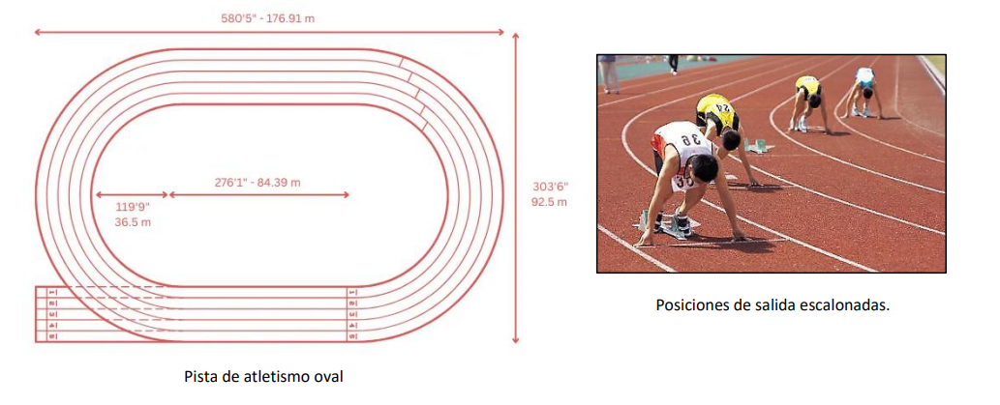

# Ejercicio 01 - Movimiento circular

**Fecha:** 31-03-2026
**Estado:** 🟢 Resuelto solo

## Consigna

Una pista de carreras de atletismo tiene forma oval, formada por tramos rectos y tramos semicirculares (ver figura). En los tramos circulares, el radio interno mide $36{,}50m$ y el radio externo mide $46{,}25m$. Para que todos los trayectos de los corredores tengan la misma longitud, las posiciones de salida de los corredores están escalonadas, según la cantidad de vueltas de la carrera.

1. En una carrera de una vuelta, ¿cuál debe ser la separación inicial entre el corredor del carril más interno y el del más externo? Por simplicidad, considera los corredores como cuerpos puntuales que corren por el contorno interno o externo de la pista. ¿Qué cambiaría si la carrera fuera de dos vueltas completas?
2. Supongamos que los corredores mantienen una velocidad de $8{,}50m/s$ en las secciones circulares. ¿Cuál es el módulo de su aceleración?

## Resolución

### Parte 1

- En una carrera de una vuelta, ¿cuál debe ser la separación inicial entre el corredor del carril más interno y el del más externo? Por simplicidad, considera los corredores como cuerpos puntuales que corren por el contorno interno o externo de la pista. ¿Qué cambiaría si la carrera fuera de dos vueltas completas?

Como se puede apreciar intuitivamente y en la imagen, el problema que queremos resolver es que el corredor del carril más interno correrá considerablemente menos distancia que el corredor del carril más externo.
Esta diferencia se debe a que las dos semicircunferencias de los lados tienen diferencias dependiendo de si usamos el radio interno o el externo para el cálculo, por lo tanto veamos cuánta es la distancia recorrida en la parte curva de la pista según los diferentes radios.

- $L_{ext}=2\pi\cdot46{,}25m=290{,}6m$
- $L_{int}=2\pi\cdot36{,}50m=229{,}3m$
- $\Delta L=290{,}6m-229{,}3=61{,}3m$

Entonces por cada vuelta dada, el corredor del carril más externo recorre $61{,}30m$ más que el del carril interno.
Esa es la distancia que tendríamos que agregar al primer carril.

En caso de ser dos vueltas la distancia tendría que duplicarse, por lo tanto sería $122{,}6m$.

### Parte 2

- Supongamos que los corredores mantienen una velocidad de $8{,}50m/s$ en las secciones circulares. ¿Cuál es el módulo de su aceleración?

Se entiende que se hace referencia a la aceleración de las secciones circulares, no las demás, entonces la respuesta es $a=\frac{v^2}{r}$.
Como aparece el radio, tendremos que distinguir entre el corredor del carril interno del corredor del carril externo.

- $a_{ext}=\frac{8{,}50^2m^2/s^2}{46{,}25m}=\frac{72{,}3m^2/s^2}{46{,}25m}=1.56m/s^2$
- $a_{int}=\frac{8{,}50^2m^2/s^2}{36{,}50m}=\frac{72{,}3m^2/s^2}{36{,}50m}=1.98m/s^2$
