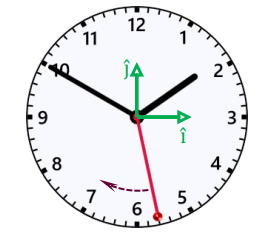

# Ejercicio 02 - Movimiento circular

**Fecha:** 31-03-2026
**Estado:** 🟢 Resuelto solo

## Consigna

Una partícula está situada en el extremo libre del segundero de un reloj de aguja, completando una revolución cada minuto. El segundero mide $15\ \text{cm}$. El contorno del reloj tiene doce divisiones equiespaciadas, numeradas del 1 al 12.

1. ¿Cuántos grados y cuántos radianes por segundo se mueve la partícula?
2. Determina el vector de velocidad media de la partícula cuando el segundero pasa desde el número 3 hasta el número 9. Expresa el resultado utilizando los versores $\hat{\imath}$ y $\hat{\jmath}$ de la figura y determina el módulo del vector.  
Repite el cálculo para el intervalo entre los números 3 y 7.
3. ¿Existe alguna posición del segundero en la cual la velocidad instantánea de la partícula tiene la misma dirección que la de la velocidad media entre los números 3 y 9? Discute también para el caso entre los números 3 y 7.
4. ¿Existe alguna posición en la cual la dirección de la aceleración instantánea de la partícula es igual a la de la velocidad media entre el 3 y el 9?

## Resolución

### Parte 1

- ¿Cuántos grados y cuántos radianes por segundo se mueve la partícula?

Una vuelta representa un minuto, y un minuto tiene $60$ segundos, por lo tanto tenemos que dividir una vuelta $60$.

- $\theta_{gr}=\frac{360^{\circ}}{60}=6^{\circ}$, o alternativamente:
- $\theta_{rad}=\frac{2\pi}{60}=\frac{\pi}{30}rad=0{,}1rad$

### Parte 2

- Determina el vector de velocidad media de la partícula cuando el segundero pasa desde el número 3 hasta el número 9. Expresa el resultado utilizando los versores $\hat{\imath}$ y $\hat{\jmath}$ de la figura y determina el módulo del vector.  
Repite el cálculo para el intervalo entre los números 3 y 7.

Recordemos que $\overline{v}=\frac{\Delta r}{\Delta t}$. Entre el número 3 y el número 9 tenemos que $\Delta t=45s-15s=30s$.

Por otra parte, expresamos las posiciones usando vectores:

- $r_i=\begin{pmatrix}15cm\cdot\cos(0)&15cm\cdot\sin(0)\end{pmatrix}=\begin{pmatrix}15cm&0\end{pmatrix}$
- $r_f=\begin{pmatrix}15cm\cdot\cos(\pi)&15cm\cdot\sin(\pi)\end{pmatrix}=\begin{pmatrix}-15cm&0\end{pmatrix}$
- $\Delta r=r_f-r_i=\begin{pmatrix}-30cm&0\end{pmatrix}$

Entonces:

- $\overline{v}=\frac{1}{30s}\cdot\begin{pmatrix}-30cm&0\end{pmatrix}=\begin{pmatrix}-1{,}0cm/s&0\end{pmatrix}\quad$ o utilizando versores:
- $\overline{v}=-1{,}0\hat{\imath}cm/s$

Repitiendo el proceso para el intervalo entre los números 3 y 7:

- $r_i=\begin{pmatrix}15cm\cdot\cos(0)&15cm\cdot\sin(0)\end{pmatrix}=\begin{pmatrix}15cm&0\end{pmatrix}$
- $r_f=\begin{pmatrix}15cm\cdot\cos(\frac{2\pi}{3})&15cm\cdot\sin(\frac{2\pi}{3})\end{pmatrix}=\begin{pmatrix}15cm\cdot(-0{,}5)&15cm\cdot(-0{,}87)\end{pmatrix}=\begin{pmatrix}-7{,}5cm&-14cm\end{pmatrix}$
- $\Delta r=r_f-r_i=\begin{pmatrix}-23cm&-14cm\end{pmatrix}$

Y recordando que $\Delta t=20s$ entre el número 3 y 9, tenemos que:

- $\overline{v}=\frac{1}{20s}\cdot\begin{pmatrix}-23cm&-14cm\end{pmatrix}=\begin{pmatrix}-1{,}2cm/s&-0{,}7cm/s\end{pmatrix}\quad$ o utilizando versores:
- $\overline{v}=-1{,}2\hat{\imath}cm/s-0{,}7\hat{\jmath}cm/s$

### Parte 3

- ¿Existe alguna posición del segundero en la cual la velocidad instantánea de la partícula tiene la misma dirección que la de la velocidad media entre los números 3 y 9? Discute también para el caso entre los números 3 y 7.

La respuesta a esta pregunta es conceptual.

Para el caso entre los números 3 y 9 la respuesta es **SI**. Tenemos que la velocidad media es $\overline{v}=-1{,}0\hat{\imath}cm/s$, es decir que la dirección es horizontal hacia la izquierda. Como la velocidad instantánea es tangente a la trayectoria (el círculo), los puntos que buscamos son el número 6 y 12, pues ahí la dirección de la velocidad instantánea también es horizontal.

Por otra parte, para el caso entre los números 3 y 7, la respuesta es **SI** también. Pero determinar cual es este punto es más complicado. Como la velocidad media es $\overline{v}=-1{,}2\hat{\imath}cm/s-0{,}7\hat{\jmath}cm/s$, tenemos que la dirección es oblicua hacia abajo y la izquierda.
Los puntos que buscamos se encuentran entre los números 3 y 6, (ya que la tangente en esos puntos toma una dirección oblicua hacia la izquierda); también entre los números 9 y 12.

### Parte 4

- ¿Existe alguna posición en la cual la dirección de la aceleración instantánea de la partícula es igual a la de la velocidad media entre el 3 y el 9?

Recordemos que la velocidad media en este arco es $\overline{v}=-1{,}0\hat{\imath}cm/s$. Entonces la respuesta es **SI**, recordemos que la aceleración instantánea tiene una dirección hacia el centro, por lo tanto en los puntos 3 y 9 específicamente, la dirección es horizontal como la dirección de la velocidad media.