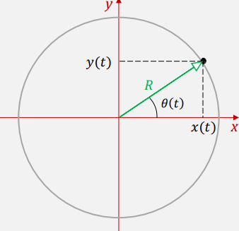

# Ejercicio 04 - Movimiento circular

**Fecha:** 06-04-2026
**Estado:** 🟢 Resuelto solo

## Consigna

Una partícula mantiene un movimiento circular uniforme, siguiendo un círculo de radio $R$ centrado en el origen. Su vector de posición forma con el eje $x$ de coordenadas un ángulo $\theta(t) = \omega t$ (en radianes), donde $\omega$ es una constante positiva ($\omega > 0$).

1. Encuentra las componentes cartesianas de la posición de la partícula en función del tiempo.
2. Calcula las componentes de la velocidad de la partícula en función del tiempo.
3. Demuestra que la velocidad tiene módulo constante de valor $R\omega$, y que es perpendicular al vector de posición.
4. Calcula las componentes de la aceleración de la partícula en función del tiempo.
5. Prueba que el vector de aceleración apunta en el sentido opuesto al vector de posición y calcula su módulo en función de $R$ y $\omega$.

## Resolución

### Parte 1

- Encuentra las componentes cartesianas de la posición de la partícula en función del tiempo.

Observando la imágen esto es sumamente sencillo, ya que es trigonometría básica.

- $x(t)=R\cdot\cos(\omega t)$
- $y(t)=R\cdot\sin(\omega t)$

Esto nos da una función posición $r(t)=(R\cdot\cos(\omega t),R\cdot\sin(\omega t))$

### Parte 2

- Calcula las componentes de la velocidad de la partícula en función del tiempo.

Esto es bien simple ya que tenemos la función posición $r(t)$ y la podemos derivar fácilmente (no corresponde a este curso pero sabemos que es diferenciable, por eso podemos hacerlo sin problema). Entonces:

- $v(t)=(-R\omega\sin(\omega t),R\omega\cos(\omega t))$

### Parte 3

- Demuestra que la velocidad tiene módulo constante de valor $R\omega$, y que es perpendicular al vector de posición.

Recordemos que el módulo de $v$ es $\sqrt{v_x^2+v_y^2}$ y por lo tanto:

$$
\begin{aligned}
&|v|\\
&=\scriptstyle{(\text{cálculo de norma})}\\
&\sqrt{(-R\omega\sin(\omega t))^2+(R\omega\cos(\omega t))^2}\\
&=\scriptstyle{(\text{operatoria})}\\
&\sqrt{R^2\omega^2\sin^2(\omega t)+R^2\omega^2\cos^2(\omega t)}\\
&=\scriptstyle{(\text{operatoria})}\\
&\sqrt{R^2\omega^2(\sin^2(\omega t)+\cos^2(\omega t))}\\
&=\scriptstyle{(\text{operatoria:}\sin^2(\omega t)+\cos^2(\omega t)=1)}\\
&\sqrt{R^2\omega^2}\\
&=\scriptstyle{(\text{operatoria})}\\
&R\omega
\end{aligned}
$$

Y para probar la perpendicularidad, usamos el producto escalar entre $r(t)$ y $v(t)$:

$$
\begin{aligned}
&\left<v(t), r(t)\right>\\
&=\scriptstyle{(\text{definición de los vectores})}\\
&\left<(-R\omega\sin(\omega t),R\omega\cos(\omega t)), (R\cdot\cos(\omega t),R\cdot\sin(\omega t))\right>\\
&=\scriptstyle{(\text{producto escalar estándar})}\\
&-R^2\omega\sin(\omega t)\cos(\omega t)+R^2\omega\cos(\omega t)\sin(\omega t)\\
&=\scriptstyle{(\text{operatoria})}\\
&0
\end{aligned}
$$

### Parte 4

- Calcula las componentes de la aceleración de la partícula en función del tiempo.

Esto es bien simple ya que tenemos la función posición $v(t)$ y la podemos derivar fácilmente (no corresponde a este curso pero sabemos que es diferenciable, por eso podemos hacerlo sin problema). Entonces:

- $a(t)=(-R\omega^2\cos(\omega t),-R\omega^2\sin(\omega t))$

### Parte 5

- Prueba que el vector de aceleración apunta en el sentido opuesto al vector de posición y calcula su módulo en función de $R$ y $\omega$.

Vayamos primero con el módulo:

$$
\begin{aligned}
&|a|\\
&=\scriptstyle{(\text{definición de norma})}\\
&\sqrt{(-R\omega^2\cos(\omega t))^2+(-R\omega^2\sin(\omega t))^2}\\
&=\scriptstyle{(\text{operatoria})}\\
&\sqrt{R^2\omega^4\cos^2(\omega t)+R^2\omega^4\sin^2(\omega t)}\\
&=\scriptstyle{(\text{operatoria})}\\
&\sqrt{R^2\omega^4(\cos^2(\omega t)+\sin^2(\omega t))}\\
&=\scriptstyle{(\text{operatoria: }\cos^2(\omega t)+\sin^2(\omega t)=1)}\\
&R\omega^2
\end{aligned}
$$

Ahora, para probar que el vector aceleración apunta en el sentido opuesto al vector de posición, recordemos que:

- $r(t)=(R\cos(\omega t),R\sin(\omega t))$
- $a(t)=(-R\omega^2\cos(\omega t),-R\omega^2\sin(\omega t))$

Al observar con detalle tenemos que:

- $a(t)=-\omega^2r(t)$

Y por lo tanto, el vector aceleración apunta en el sentido opuesto al vector de posición (dado por el menos multiplicando).