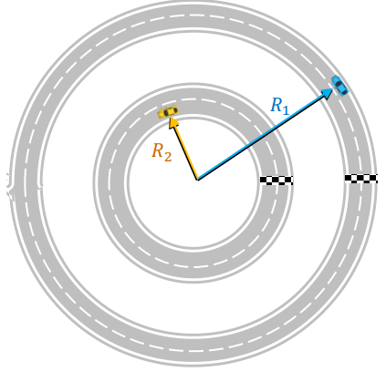

# Ejercicio 05 - Movimiento circular

**Fecha:** 06-04-2026
**Estado:** 🟢 Resuelto solo

## Consigna

Dos autos están recorriendo dos pistas circulares concéntricas con rapidez constante. El auto de la pista exterior se mantiene a una distancia $R_1$ del centro. El de la pista interior se mantiene a una distancia $R_2$ igual a la mitad de $R_1$.
El piloto de la pista exterior experimenta una aceleración de módulo $a_1$. Este observa que, en el tiempo en que a él le lleva dar una vuelta completa, el piloto que va por la pista interior da 4 vueltas completas.

1. ¿Cuál es, en función de $a_1$ y $R_1$, la rapidez del auto que va por la pista exterior? Recuerda que la rapidez indica el módulo de la velocidad.
2. ¿Qué proporción hay entre la rapidez de cada auto? Expresa esta proporción usando los radios de las trayectorias y el tiempo que cada uno emplea en recorrerla.
3. Calcula, en función de $a_1$ y los radios, la rapidez con la que se desplaza el piloto en la pista interior.
4. ¿Cuánto vale la proporción entre los módulos de las aceleraciones de los autos?
5. Calcula el módulo de la aceleración $a_2$ experimentada por el piloto de la pista interior. ¿Es $a_2$ mayor que, menor que o igual a $a_1$? ¿Por qué?

## Resolución

### Parte 1

- ¿Cuál es, en función de $a_1$ y $R_1$, la rapidez del auto que va por la pista exterior? Recuerda que la rapidez indica el módulo de la velocidad.

Recordemos la siguiente fórmula para la aceleración en este tipo de movimiento:

- $a=\frac{v^2}{r}$

Por lo tanto, tenemos que:

- $|v|=\sqrt{ar}$, o utlizando los valores que tenemos:
- $|v|=\sqrt{a_1R_1}$

### Parte 2

- ¿Qué proporción hay entre la rapidez de cada auto? Expresa esta proporción usando los radios de las trayectorias y el tiempo que cada uno emplea en recorrerla.

Para el movimiento circular que estamos estudiando, sabemos que la velocidad es constante en magnitud, por lo tanto podemos calcularla usando:

- $|v|=\frac{\text{distancia recorrida}}{\text{tiempo}}$

Entonces para calcular la proporción:

$$
\begin{aligned}
&\frac{|v_2|}{|v_1|}\\
&=\scriptstyle{(\text{sustituyendo lo conocido})}\\
&\frac{2\pi R_2/t}{2\pi R_1/4t}\\
&=\scriptstyle{(\text{operatoria})}\\
&\frac{2\pi R_2}{t}\cdot\frac{4t}{2\pi R_1}\\
&=\scriptstyle{(\text{operatoria})}\\
&\frac{4R_2}{R_1}\\
&=\scriptstyle{(\text{sabiendo que }\frac{R_2}{R_1}=\frac{1}{2})}\\
&2
\end{aligned}
$$

### Parte 3

- Calcula, en función de $a_1$ y los radios, la rapidez con la que se desplaza el piloto en la pista interior.

Esto es bien fácil usando la parte anterior, tenemos que:

- $|v_1|=\sqrt{a_1R_1}$, y
- $|v_2|=2|v_1|$

Por lo tanto, $|v_2|=2\sqrt{a_1R_1}$. Además utilizando que $R_2=\frac{R_1}{2}$, tenemos que:

- $|v_2|=2\sqrt{2a_1R_2}$

### Parte 4

- ¿Cuánto vale la proporción entre los módulos de las aceleraciones de los autos?

Recordemos que $a_2=\frac{v_2^2}{R_2}$, por lo tanto podemos operar:

$$
\begin{aligned}
&\frac{a_2}{a_1}\\
&=\scriptstyle{(\text{como }a_2=\frac{v_2^2}{R_2}=\frac{4a_1R_1}{R_1/2})}\\
&\frac{4a_1R_1}{R_1/2}\cdot\frac{1}{a_1}\\
&=\scriptstyle{(\text{operatoria})}\\
&\frac{8R_1}{R_1}\\
&=\scriptstyle{(\text{operatoria})}\\
&8
\end{aligned}
$$

### Parte 5

- Calcula el módulo de la aceleración $a_2$ experimentada por el piloto de la pista interior. ¿Es $a_2$ mayor que, menor que o igual a $a_1$? ¿Por qué?

Esto ya lo hicimos en la parte anterior, donde vimos que $a_2=8a_1$. Por lo tanto $a_2$ es mayor que $a_1$. Para interpretar este resultado, recordemos los factores que intervienen en determinar el módulo de la aceleración:

- $a=\frac{v^2}{r}$

Y esto lo deja muy claro, ya que sabemos que:

- $v_2=2v_1$, y por lo tanto $v_2$ es mayor que $v_1$
- $R_2=\frac{R_1}{2}$, y al estar dividiendo hace que $a_2$ sea mayor que $a_1$.