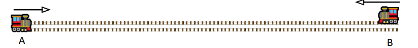

# Ejercicio 06 - Movimiento relativo

**Fecha:** 07-04-2026
**Estado:** 🟡 Con ayuda

## Consigna

1. Dos trenes, $A$ y $B$, salen al mismo tiempo de dos estaciones situadas a $300km$ entre sí, uno rumbo al otro. Asumamos que las vías que conectan las estaciones son rectas y que las velocidades de los trenes son constantes. La rapidez del tren $A$ es de $80km/h$ y la del tren $B$ es de $70km/h$. ¿Cuánto tiempo tardarán en encontrarse?

    

2. El conductor del tren $A$ advierte que a una distancia de $1km$ por delante en la misma vía, hay otro tren $C$ moviéndose en el mismo sentido, pero con velocidad constante de $60km/h$. El conductor aplica la máxima aceleración de frenado del tren, de módulo $0{,}2m/s^2$. ¿Es la separación entre los trenes suficiente para evitar un choque? ¿Cuáles son los valores de aceleración posibles para que no haya una colisión?

Para contestar las preguntas anteriores se puede utilizar un sistema de referencia solidario a las vías o solidario a alguno de los trenes, por ejemplo. ¿Cuáles de las respuestas dependen o no de esta elección? ¿Qué ventajas tiene usar un sistema de referencia solidario a uno de los trenes?

## Resolución

### Parte 1

- Dos trenes, $A$ y $B$, salen al mismo tiempo de dos estaciones situadas a $300km$ entre sí, uno rumbo al otro. Asumamos que las vías que conectan las estaciones son rectas y que las velocidades de los trenes son constantes. La rapidez del tren $A$ es de $80km/h$ y la del tren $B$ es de $70km/h$. ¿Cuánto tiempo tardarán en encontrarse?

Como las velocidades de los trenes son constantes, tenemos una función posición para cada uno de ellos:

- $r_A=80km/h\cdot t+{r_A}_0$
- $r_B=70km/h\cdot t+{r_B}_0$

En las posiciones iniciales entra en juego el movimiento relativo. Consideraremos el movimiento centrado en el tren $A$, por lo que las posiciones iniciales son:

- ${r_A}_0=0$
- ${r_B}_0=300km$

Pero pasó algo con la velocidad del tren $B$... Si estamos centrando en el tren $A$, y mantenemos las funciones posición como las tenemos, entonces el sentido de ambos es igual. Esto no representa la realidad, el sentido del tren $B$ claramente es opuesto al de $A$, por lo tanto:

- $r_A(t)=80km/h\cdot t$
- $r_B(t)=-70km/h\cdot t+300km$

A este punto, solo tenemos que igualar las funciones y ver para que $t$ se cumple la igualdad.

$$
\begin{aligned}
&r_A(t)=r_B(t)\\
&\iff\scriptstyle{(\text{reemplazando por las funciones conocidas})}\\
&80km/h\cdot t=-70km/h\cdot t+300km\\
&\iff\scriptstyle{(\text{operatoria})}\\
&150km/h\cdot t=300km\\
&\iff\scriptstyle{(\text{operatoria})}\\
&t=\frac{300km}{150km/h}\\
&\iff\scriptstyle{(\text{operatoria})}\\
&t=2h
\end{aligned}
$$

Por lo tanto, los trenes tardarán dos horas en encontrarse.

### Parte 2

- El conductor del tren $A$ advierte que a una distancia de $1km$ por delante en la misma vía, hay otro tren $C$ moviéndose en el mismo sentido, pero con velocidad constante de $60km/h$. El conductor aplica la máxima aceleración de frenado del tren, de módulo $0{,}2m/s^2$. ¿Es la separación entre los trenes suficiente para evitar un choque? ¿Cuáles son los valores de aceleración posibles para que no haya una colisión?

Supondremos en este caso (ya que no aclara la letra) que el frenado comienza en $t=0$.
Nuevamente los datos que tenemos nos permiten describir las funciones posición de ambos trenes centrando el movimiento en el tren $A$ .

- $r_A(t)=22m/s\cdot t-\frac{1}{2}\cdot0.2m/s^2\cdot t^2$
- $r_C(t)=17m/s\cdot t+1km$

Antes de avanzar, vamos a modificar las unidades para trabajar con las mismas en ambas funciones:

- $r_A(t)=22.2m/s\cdot t-0.1m/s^2\cdot t^2$
- $r_C(t)=16.7m/s\cdot t+1000m$

Con esto estamos en condiciones de igualar las expresiones y si existe alguna solución, entonces efectivamente los trenes $A$ y $C$ colisionan para el $t$ encontrado.

$$
\begin{aligned}
&r_A(t)=r_C(t)\\
&\iff\scriptstyle{(\text{reemplazando por las funciones conocidas})}\\
&22.2m/s\cdot t-0.1m/s^2\cdot t^2=16.7m/s\cdot t+1000m\\
&\iff\scriptstyle{(\text{operatoria})}\\
&-1000m+5.5m/s\cdot t-0.1m/s^2\cdot t^2=0\\
&\iff\scriptstyle{(\text{Bháskara})}\\
&t=\frac{-5.5\pm\sqrt{5.5^2-4\cdot1000\cdot0.1}}{2\cdot0.2}m
\end{aligned}
$$

Llegados a este punto, claramente se observa que el discriminante es negativo, esto implica que las raíces son complejas y por lo tanto no tienen un sentido físico para este problema.
Para nosotros entonces no hay solución, lo que significa que **no colisionan**.

Hay muchos valores de aceleración $a$ para que los trenes mencionados no colisionen, pero va a estar determinado por el discriminante:

- $\Delta=5.5^2-4\cdot(-1000)\cdot \frac{a}{2}$

Entonces hallemos la raíz de esta función:

$$
\begin{aligned}
&\Delta=0\\
&\iff\scriptstyle{(\text{reemplazando la función conocida})}\\
&5.5^2-4\cdot(-1000)\cdot \frac{a}{2}=0\\
&\iff\scriptstyle{(\text{operatoria})}\\
&30.25+2000a=0\\
&\iff\scriptstyle{(\text{operatoria})}\\
&a=\frac{-30.25}{2000}\\
&\iff\scriptstyle{(\text{operatoria})}\\
&a\approx-0.0151m/s
\end{aligned}
$$

Entonces, para cualquier $a$ mayor a $-0.0151m/s$ tendremos que el discriminante será menor que cero, y por lo tanto no existen raíces reales, por lo que finalmente los trenes no colisionan.