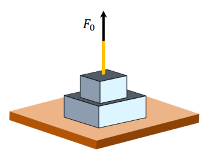

# Ejercicio 02 - Fuerzas y leyes de Newton

**Fecha:** 09-04-2026
**Estado:** 🟢 Resuelto solo

## Consigna

Sobre la superficie de una mesa se encuentra apoyada una caja de $6.0kg$ de masa y, sobre esta, otra caja de $3.0kg$; ambas cajas están en reposo. Mediante una cuerda, se tira hacia arriba de la caja superior con una fuerza $F_0=15.0N$.

1. Calcula los pesos de cada caja, la fuerza que la caja grande ejerce sobre la caja pequeña y la fuerza que la mesa ejerce sobre la caja grande.
2. Para cada una de las fuerzas sobre las cajas, indica cuál es la pareja correspondiente aplicando el principio de acción y reacción (tercera ley de Newton).
3. Si la fuerza $F_0$ con la cual se tira de la cuerda aumenta, ¿qué ocurre con las fuerzas halladas en la parte 1? Discute según si el módulo de la fuerza de la cuerda es menor, igual o mayor que el peso de la caja superior.

## Resolución

### Parte 1

- Calcula los pesos de cada caja, la fuerza que la caja grande ejerce sobre la caja pequeña y la fuerza que la mesa ejerce sobre la caja grande.

Para calcular los pesos de cada caja, tenemos una fórmula bastante simple:

- $W=m\cdot g$

Entonces podemos calcular las fuerzas peso de manera bastante simple:

- $W_{pequeña}=3.0kg\cdot 9.8m/s^2=29.4N$
- $W_{grande}=6.0kg\cdot9.8m/s^2=58.8N$

Ahora, veamos en detalle por cada caja que fuerzas actúan para no perdernos ningún detalle.

1. **Caja pequeña:**
    - $W_{pequeña}$: fuerza peso ejercida por la Tierra, ya la calculamos.
    - $F_{grande\to pequeña}$: fuerza de contacto ejercida por la caja grande. Sabemos que va hacia arriba pero no su módulo.
    - $F_0$: fuerza de tensión ejercida por la cuerda. Conocemos esta fuerza por la letra.

2. **Caja grande:**
    - $W_{grande}$: fuerza peso ejercida por la Tierra, ya la calculamos.
    - $F_{pequeña\to grande}$: fuerza de contacto ejercida por la caja pequeña. Sabemos que va hacia abajo pero no su módulo.
    - $F_{mesa}$: fuerza de contacto ejercida por la mesa. Sabemos que va hacia abajo pero no su módulo.

Entonces, en este punto sabemos quienes son las fuerzas que actúan sobre cada caja, sabemos también que ambas están en reposo por lo que la suma de todas sus fuerzas tiene que ser cero (**primera ley de Newton**).
Empezaremos desarrollando las fuerzas para la caja pequeña (ya que nos falta conocer una sola de sus fuerzas) y luego veremos como hallar las de la caja grande.

$$
\begin{aligned}
&\sum F_{pequeña}=0\\
&\iff\scriptstyle{(\text{explicitando los sumandos})}\\
&W_{pequeña}+F_{grande\to pequeña}+F_0=0\\
&\iff\scriptstyle{(\text{reemplazando los valores conocidos})}\\
&-29.4N+F_{grande\to pequeña}+15.0N=0\\
&\iff\scriptstyle{(\text{operatoria})}\\
&F_{grande\to pequeña}=14.4N\\
\end{aligned}
$$

Esta es una de las respuestas que nos solicitaban, ahora para hallar las fuerzas de la caja grande tenemos dos fuerzas desconocidas... Por suerte, una de las fuerzas es la fuerza que ejerce la caja pequeña sobre la grande, y la **tercera ley de Newton** nos dice que:

- $F_{pequeña\to grande}=-F_{grande\to pequeña}$, entonces:
- $F_{pequeña\to grande}=-14.4N$

Y ahora si, podemos desarrollar el caso de la caja grande:

$$
\begin{aligned}
&\sum F_{grande}=0\\
&\iff\scriptstyle{(\text{explicitando los sumandos})}\\
&W_{grande}+F_{pequeña\to grande}+F_{mesa}=0\\
&\iff\scriptstyle{(\text{reemplazando los valores conocidos})}\\
&-58.8N-14.4N+F_{mesa}=0\\
&\iff\scriptstyle{(\text{operatoria})}\\
&F_{mesa}=73.2N\\
\end{aligned}
$$

Resumiendo, las fuerzas que nos solicitaron son:

- $W_{pequeña}=3.0kg\cdot 9.8m/s^2=29.4N$
- $W_{grande}=6.0kg\cdot9.8m/s^2=58.8N$
- $F_{grande\to pequeña}=14.4N$
- $F_{mesa}=73.2N$

### Parte 2

- Para cada una de las fuerzas sobre las cajas, indica cuál es la pareja correspondiente aplicando el principio de acción y reacción (tercera ley de Newton).

Veamos esto con una tabla:

| Fuerza de acción |  Fuerza de reacción  |
|------------------|----------------------|
| Tierra atrae a la caja ($W$) | Caja atrae a la Tierra |
| Caja grande empuja a la caja pequeña $F_{grande\to pequeña}$ | Caja pequeña empuja a la caja grande $F_{pequeña\to grande}$ |
| Mesa empuja a caja grande $F_{mesa}$ | Caja grande empuja a la mesa |
| Cuerda jala a la caja pequeña $F_0$ | Caja pequeña jala a la cuerda |

### Parte 3

- Si la fuerza $F_0$ con la cual se tira de la cuerda aumenta, ¿qué ocurre con las fuerzas halladas en la parte 1? Discute según si el módulo de la fuerza de la cuerda es menor, igual o mayor que el peso de la caja superior.

Antes de empezar a separar por cada caso, recordemos que las fuerzas que hallamos en la parte 1 son:

- $W_{pequeña}=3.0kg\cdot 9.8m/s^2=29.4N$
- $W_{grande}=6.0kg\cdot9.8m/s^2=58.8N$
- $F_{grande\to pequeña}=14.4N$
- $F_{mesa}=73.2N$

#### Caso 1

- La fuerza $F_0$ de la cuerda es menor que el peso de la caja superior.

En este caso, la fuerza $F_{grande\to pequeña}$ tendrá una dirección vertical hacia arriba, de la misma forma que la fuerza que ejerce la mesa sobre la caja grande $F_{mesa}$.
En cuánto a los módulos de estas fuerzas, cuanto menor sea la fuerza $F_0$:

- $F_{grande\to pequeña}$ decrece en módulo, mientras que
- $F_{mesa}$ crece en módulo

#### Caso 2

- La fuerza $F_0$ de la cuerda es igual que el peso de la caja superior.

En este caso particular, la fuerza $F_{grande\to pequeña}$ se anula, por lo tanto la caja pequeña se "despega" de la caja grande a partir de esta fuerza $F_0$.
Por otra parte, la fuerza que ejerce la mesa sobre la caja grande en este caso es igual en módulo que la fuerza peso de la misma.

#### Caso 3

- La fuerza $F_0$ de la cuerda es mayor que el peso de la caja superior.

En este caso la matemática nos dice que la fuerza de contacto $F_{grande\to pequeña}$ sería negativa. El tema es que esto no tiene ningún sentido físico, de hecho ya sabemos que a partir del caso de igualdad (caso anterior) las cajas no se tocan, por lo que no puede ser que la caja grande ejerza esta fuerza sobre la pequeña. La fuerza que ejerce la mesa sobre la caja grande $F_{mesa}$ se mantiene igual que el caso anterior.
Por lo tanto, a partir de este punto la caja superior se movería hacia arriba en un movimiento acelerado.
