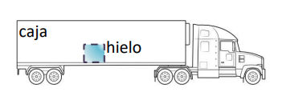

# Ejercicio 03 - Fuerza y leyes de Newton

**Fecha:** 09-04-2026
**Estado:** 🟡 Con ayuda

## Consigna

Un camión transporta un pequeño bloque de hielo seco en su caja trasera, en la cual la fricción que experimenta el bloque es totalmente despreciable.

1. El camión está inicialmente en reposo y luego acelera. Observamos que el bloque permanece quieto con respecto al camión. ¿En qué parte, dentro de la caja, se ubica el bloque? ¿Cerca del centro, en el fondo o adelante?
2. El bloque, ¿tiene aceleración? Indica todas las fuerzas que actúan sobre este y quién las ejerce.
3. Al cabo de unos segundos, el camión y el bloque se encuentran viajando a velocidad constante, de módulo $v_0 = 5m/s$. ¿Qué fuerzas actúan sobre el bloque en este momento?
4. Más tarde el camión comienza a frenar a razón de $0.5m/s^2$. Transcurridos $2$ segundos, ¿qué velocidad tendrá el camión, según un peatón inmóvil en la acera?
5. ¿Qué velocidad tendrá el bloque de hielo, según el conductor del camión?

## Resolución

### Parte 1

- El camión está inicialmente en reposo y luego acelera. Observamos que el bloque permanece quieto con respecto al camión. ¿En qué parte, dentro de la caja, se ubica el bloque? ¿Cerca del centro, en el fondo o adelante?

El bloque se encuentra en el fondo de la caja.

En la situación inicial planteada, el bloque tiene una fuerza neta horizontal de cero, pues no hay ningún agente que ejerza una fuerza horizontal sobre el bloque, por lo que va a mantener sus condiciones iniciales de movimiento (**primera ley de Newton**), que en este caso es el reposo.
Con este razonamiento, si el bloque estuviera en el centro o adelante en la caja, cuando el camión acelere el bloque se movería hacia el fondo de la caja; esto sucede porque el bloque se intentaría mantener en reposo mientras que el camión estaría acelerando.

### Parte 2

- El bloque, ¿tiene aceleración? Indica todas las fuerzas que actúan sobre este y quién las ejerce.

Según lo que vimos en la parte uno, el bloque efectivamente tiene aceleración porque está en el fondo del camión. Las fuerzas que actúan sobre él son:

- **La fuerza peso $W$:** la fuerza que ejerce la Tierra sobre el bloque.
- **La fuerza normal del piso:** la fuerza de contacto del piso al bloque.
- **La fuerza normal de la pared del camión**: la fuerza de contacto de la pared del camión con el bloque.

La fuerza peso y la fuerza normal del piso se anulan, no así la fuerza de la pared, por lo que la fuerza neta es claramente diferente de cero, y entonces el bloque presenta una aceleración por la **segunda ley de Newton**.

### Parte 3

- Al cabo de unos segundos, el camión y el bloque se encuentran viajando a velocidad constante, de módulo $v_0 = 5m/s$. ¿Qué fuerzas actúan sobre el bloque en este momento?

Poniendo el foco en el bloque, si éste está viajando a una velocidad constante, entonces necesariamente su fuerza neta tiene que ser cero.
Recordemos que las fuerzas verticales que tiene el bloque se anulan (peso y normal del piso), mientras que teníamos la fuerza horizontal aplicada por el contacto entre la pared del camión y el bloque.
Para que la fuerza neta sea cero, entonces o bien la fuerza horizontal de la pared del camión se anula con otra fuerza horizontal opuesta, o bien ya no hay fuerza de contacto entre la pared del camión y la pared.

La opción correcta es la segunda, ya que no hay ningún agente que ejerza esta fuerza opuesta que buscamos; entonces las fuerzas que actúan sobre el bloque en este momento son:

- **La fuerza peso $W$:** la fuerza que ejerce la Tierra sobre el bloque.
- **La fuerza normal del piso:** la fuerza de contacto del piso al bloque.

### Parte 4

- Más tarde el camión comienza a frenar a razón de $0.5m/s^2$. Transcurridos $2$ segundos, ¿qué velocidad tendrá el camión, según un peatón inmóvil en la acera?

La función velocidad $v(t)$ en un movimiento con aceleración como éste está dado por:

- $v(t)=v_0+at$

Como tenemos una velocidad inicial $v_0=5m/s$, la velocidad que tendrá el camión a los dos segundos es:

- $v(2)=5.0m/s-0.5m/s^2\cdot 2s=4m/s$

### Parte 5

- ¿Qué velocidad tendrá el bloque de hielo, según el conductor del camión?

Esta pregunta es un problema de movimiento relativo. Necesitamos saber la velocidad del bloque vista desde el camión después de transcurridos dos segundos.
A este punto conocemos:

- El plano $S$ que representa al plano del peatón inmóvil, mientras que el plano $S'$ representa al plano del conductor del camión.
- La velocidad del bloque $v_{BS}=5.0m/s$ vista por el peatón inmóvil desde la bereda.
- La diferencia de velocidad $v_{S'S}=-4.0m/s$ (para pasar desde el plano del conductor al plano del peatón).

Entonces tenemos que:

- $v_{BS'}=v_{S'S}+v_{BS}=-4.0m/s+5.0m/s=1.0m/s$

Esto concluye el ejercicio.