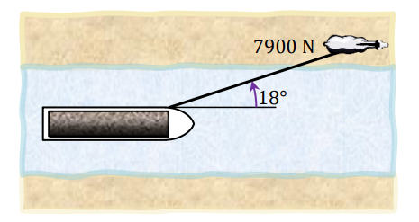

# Ejercicio 04 - Fuerzas y leyes de Newton

**Fecha:** 09-04-2026
**Estado:** 🟢 Resuelto solo

## Consigna

Años atrás, las barcazas que viajaban por los canales eran arrastradas por caballos, como se muestra en la figura. Supongamos que el caballo está ejerciendo una fuerza de $7900N$ a un ángulo de $18^\circ$ con la dirección del movimiento de la barcaza, la cual navega en línea recta por el canal. La masa de la barcaza es de $9500kg$ y su aceleración es de $0.12m/s^2$. Encuentra la fuerza ejercida por el agua sobre la barcaza.

## Resolución

Para resolver este ejercicio va a ser importante identificar todas las fuerzas que actúan sobre la barcaza.

Empezamos primero por las fuerzas que actúan sobre el plano $xy$.

- **Fuerza del caballo ${F_{caballo}}_{xy}:$** podemos calcularla con los datos de la letra:

    - ${F_{caballo}}_{xy}=(7900\cdot\cos(18^{\circ}),7900\cdot\sin(18^{\circ}))=(7513.3,2441.2)$

- **Fuerza del agua ${F_{agua}}_{xy}$:** es lo que queremos hallar.

Por otra parte, podemos usar la **segunda ley de Newton**:

$$
\begin{aligned}
&{F_{caballo}}_{xy}+{F_{agua}}_{xy}=ma\\
&\iff\scriptstyle{(\text{reemplazando valores conocidos})}\\
&(7513.3,2441.2)N+{F_{agua}}_{xy}=9500kg\cdot(0.12,0)m/s^2\\
&\iff\scriptstyle{(\text{operatoria})}\\
&{F_{agua}}_{xy}=(1140.0,0)N-(7513.3,2441.2)N\\
&\iff\scriptstyle{(\text{operatoria})}\\
&{F_{agua}}_{xy}=(-6373.3,-2441.2)N\\
&\iff\scriptstyle{(\text{utilizando versores})}\\
&{F_{agua}}_{xy}=-6373.3\hat{\imath}N,-2441.2\hat{\jmath}N\\
\end{aligned}
$$

Este análisis es correcto para las fuerzas en las dos dimensiones que estamos considerando (sin trabajar con la fuerza peso).
Veamos el mismo análisis, es decir que plantearemos la **segunda ley de Newton** pero ahora considerando solo el eje $z$, el que sale del dibujo.
Primero calculemos la fuerza peso que se ejerce sobre la barcaza:

- $W_z=mg=9500kg\cdot(-9.8m/s^2)=-93100N$

Por lo que el planteo de la **segunda ley de Newton** para el eje $z$ es:

$$
\begin{aligned}
&W_z+{F_{agua}}_z=ma_z\\
&\iff\scriptstyle{(\text{sustituyendo por valores conocidos})}\\
&-93100N+{F_{agua}}_z=95000kg\cdot0m/s^2\\
&\iff\scriptstyle{(\text{operatoria})}\\
&{F_{agua}}_z=93100N
\end{aligned}
$$

Con esto concluimos que la respuesta es que la fuerza del agua que actúa sobre la barcaza es:

- $F_{agua}=-6373.3\hat{\imath}N,-2441.2\hat{\jmath}N+93100\hat{k}N$