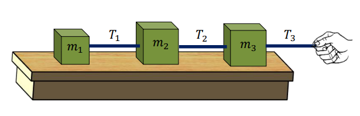

# Ejercicio 05 - Fuerzas y leyes de Newton

**Fecha:** 10-04-2026
**Estado:** 🟡 Con ayuda

## Consigna

Tres bloques están unidos como se muestra en la figura, sobre una mesa horizontal carente de fricción, siendo tirados hacia la derecha con una fuerza de módulo $T_3 = 6.5N$.

Si $m_1=1.2kg$, $m_2=2.4kg$ y $m_3=3.1kg$, calcula la aceleración del sistema y las tensiones $T_1$ y $T_2$.

Compara este sistema con una locomotora que tira de los vagones acoplados de un tren. Identifica qué elementos del sistema corresponden a la locomotora, los vagones y las fuerzas que actúan sobre ellos.

## Resolución

Para este ejercicio, haremos bastante más concreto nuestro estudio al darnos cuenta que las fuerzas verticales, ya sea para cada bloque por separado, o para todos los bloques considerados como un sistema, se anulan entre ellas (fuerza peso y fuerza normal). Por esta observación, podemos solamente trabajar con las fuerzas horizontales.

Lo primero que podemos hacer es calcular la aceleración del sistema en general, es decir considerando los bloques como una sola cosa. Con esta visión, las fuerzas $T_1$ y $T_2$ pasan a ser internas del sistema. Entonces podemos aplicar la **segunda ley de Newton** considerando $T_3$ como la única fuerza externa que actúa sobre el sistema.
Para esto tenemos que calcular la masa del sistema antes:

- $m=m_1+m_2+m_3=1.2kg+2.4kg+3.1kg=6.7kg$

Ahora si, podemos aplicar la segunda ley.

$$
\begin{aligned}
&\sum F=ma\\
&\iff\scriptstyle{(\text{reemplazando valores conocidos})}\\
&T_3=6.7kg\cdot a\\
&\iff\scriptstyle{(\text{reemplazando valores conocidos})}\\
&6.5N=6.7kg\cdot a\\
&\iff\scriptstyle{(\text{operatoria})}\\
&\frac{6.5N}{6.7kg}=a\\
&\iff\scriptstyle{(\text{operatoria})}\\
&a\approx0.97m/s^2\\
\end{aligned}
$$

Con esto podremos usar la **segunda ley de Newton** para cada bloque por separado más facilmente para hallar las tensiones $T_1$ y $T_2$.

Empecemos por el bloque 1 que será el más fácil porque tiene una única fuerza horizontal.

$$
\begin{aligned}
&\sum F_1=m_1a\\
&\iff\scriptstyle{(\text{reemplazando valores conocidos})}\\
&T_1=1.2kg\cdot 0.97m/s^2\\
&\iff\scriptstyle{(\text{operatoria})}\\
&T_1\approx1.16N
\end{aligned}
$$

Podemos pasar al bloque 2, pero en este caso tendremos dos fuerzas que actúan sobre él: la fuerza $T_2$ y la fuerza $F_{1\to2}$ que aplica el bloque 1 al 2 por la **tercera ley de Newton** $(F_{1\to2}=-T_1=-1.16N)$. Entonces:

$$
\begin{aligned}
&\sum F_2=m_2a\\
&\iff\scriptstyle{(\text{reemplazando valores conocidos})}\\
&T_2+F_{1\to2}=2.4kg\cdot0.97m/s^2\\
&\iff\scriptstyle{(\text{reemplazando valores conocidos})}\\
&T_2-1.16N=2.4kg\cdot0.97m/s^2\\
&\iff\scriptstyle{(\text{operatoria})}\\
&T_2-1.16N\approx2.33N\\
&\iff\scriptstyle{(\text{operatoria})}\\
&T_2\approx2.33N+1.16N\\
&\iff\scriptstyle{(\text{operatoria})}\\
&T_2\approx3.49N\\
\end{aligned}
$$

Resumiendo entonces, las respuestas son:

- $a\approx0.97m/s^2$
- $T_1\approx1.16N$
- $T_2\approx3.49N$