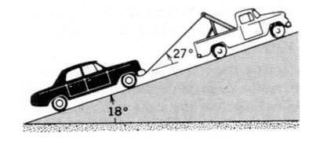
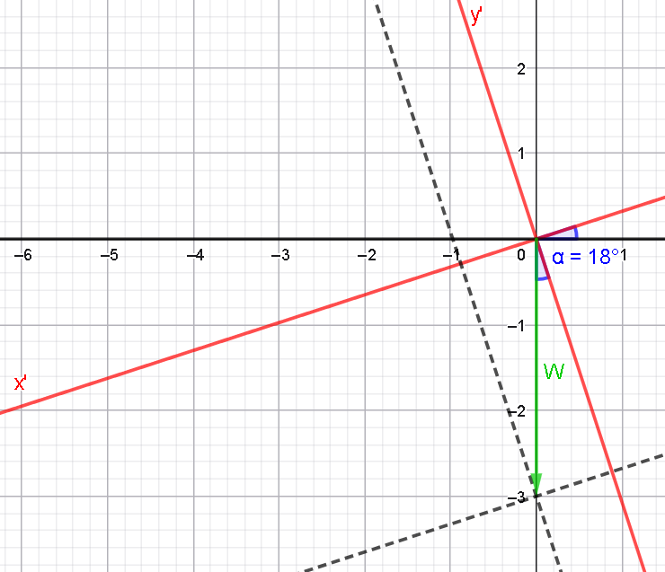

# Ejercicio 06 - Fuerzas y leyes de Newton

**Fecha:** 10-04-2026
**Estado:** 🟡 Con ayuda

## Consigna

Un automóvil de $1200kg$ está siendo arrastrado por un plano inclinado a $18^\circ$ por medio de un cable atado a la parte trasera de un camión grúa. El cable forma un ángulo de $27^\circ$ con el plano inclinado. ¿Cuál es la mayor distancia que el automóvil puede ser arrastrado en los primeros $7.5s$ después de arrancar desde el reposo si el cable tiene una resistencia a la rotura de $4.6kN$? Desprecia todas las fuerzas de fricción sobre el automóvil.

## Resolución

La gran dificultad de este ejercicio es plantear bien el problema. Lo primero que intenté para resolverlo es trabajar con el plano de siempre $xy$. Eventualmente llegué a un punto muerto y me replanteé el como había empezado.

El camino "correcto" o por lo menos el que más simplifica las cosas, es trabajar **SOLO** en el eje de movimiento que en este caso es el eje que forma un ángulo de $18^{\circ}$ con el eje $x$, llamaremos $x'$ a este eje. Esto es porque el movimiento es a lo largo del eje $x'$, por lo que las fuerzas en el eje $y'$ (perpendicular a $x'$) se tienen que anular (**segunda ley de Newton**). 
Las fuerzas que tenemos que considerar son la fuerza peso (específicamente en ese eje) y la fuerza que genera el cable del camión grúa (nuevamente en este eje).

En definitiva el proceso que hacemos es:

1. Considerar el eje $x'$ que mencionamos anteriormente, y otro $y'$ perpendicular a este (forma también un ángulo de $18^{\circ}$ con el eje $y$).
2. Descomponer la fuerza peso **en función de los ejes $x'$ e $y'$**.
3. Encontrar la fuerza que ejerce el peso específicamente en el eje $x'$. Ésta es la fuerza que queremos considerar para poder usar la segunda ley de Newton en este eje.

Entonces, primero hallemos la fuerza peso $W$:

- $W=1200kg\cdot 9.8m/s^2=11760N$

Ahora veamos un dibujo para entender como hallamos $W_{x'}$, es decir el componente "horizontal" de $W$ para el plano $x'y'$:

Con el dibujo vemos que la componente en el eje $x'$ de $W$ que buscamos se halla con:

- $W_{x'}=|W|\cdot\sin\alpha=11760N\cdot\sin(18^{\circ})=3634.0$

Pero tenemos que tener cuidado, claramente la fuerza es hacia la "izquierda" del eje $x'$, por lo que el signo es negativo.

- $W_{x'}=-3634.0$

Tenemos gran parte del problema resuelto ahora, nos faltaría determinar la componente en el eje $x'$ de la fuerza que genera el cable del camión grúa cuando se lo exige hasta su máxima resistencia de rotura.
Esto es considerablemente más fácil que lo que tuvimos que hacer en el paso anterior, ya que tenemos directamente el ángulo que forma la fuerza con nuestro eje $x'$. Entonces:

- $C_{x'}=|C|\cdot\cos(\theta)=4600N\cdot\cos(27^{\circ})=4098.0N$

Ahora si podemos aplicar la **segunda ley de Newton** en el eje $x'$ para calcular la aceleración en esta dirección:

$$
\begin{aligned}
&\sum F_{x'}=ma_{x'}\\
&\iff\scriptstyle{(\text{reemplazando por valores conocidos})}\\
&C_{x'}+W_{x'}=1200kg\cdot a_{x'}\\
&\iff\scriptstyle{(\text{reemplazando por valores conocidos})}\\
&4098N-3634N=1200kg\cdot a_{x'}\\
&\iff\scriptstyle{(\text{operatoria})}\\
&\frac{464N}{1200kg}=a_{x'}\\
&\iff\scriptstyle{(\text{operatoria})}\\
&a_{x'}=0.3867m/s^2
\end{aligned}
$$

Entonces tenemos una función para la posición en el tiempo con:

- $r(t)=r_0+v_0t+\frac{1}{2}at^2$, con
- $r_0=0$, y
- $v_0=0$

Por lo que la distancia recorrida a los $7.5s$ es:

$$
\begin{aligned}
&r(7.5)=\frac{1}{2}a\cdot 7.5^2\\
&\iff\scriptstyle{(\text{reemplazando los valores conocidos})}\\
&r(7.5)=\frac{1}{2}\cdot0.3867m/s^2\cdot 7.5^2s^2\\
&\iff\scriptstyle{(\text{operatoria})}\\
&r(7.5)=0.1934m/s^2\cdot 56.25s^2\\
&\iff\scriptstyle{(\text{operatoria})}\\
&r(7.5)=0.1934m/s^2\cdot 56.25s^2\\
&\iff\scriptstyle{(\text{operatoria})}\\
&r(7.5)=10.88m
\end{aligned}
$$

Esto concluye el ejercicio.