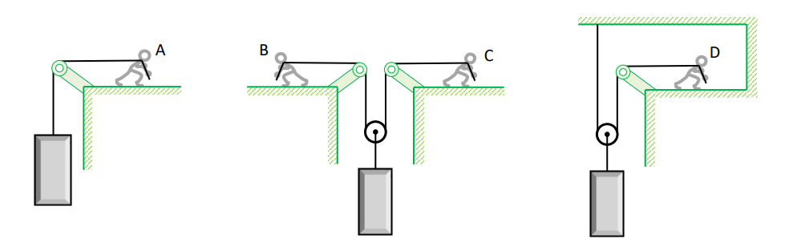

# Ejercicio 07 - Fuerzas y leyes de Newton

**Fecha:** 10-04-2026
**Estado:** 🟢 Resuelto solo

## Consigna

En una mudanza hay que subir una heladera grande varios pisos, utilizando cuerdas y poleas para poder hacerlo. Compara las diferentes configuraciones ilustradas en la figura. En todos los casos la heladera sube a velocidad constante. Considera la masa de las poleas y las cuerdas despreciable.

1. ¿Cuál de las personas, A, B, C o D, tiene que ejercer una fuerza mayor? ¿Cuál o cuáles ejercen la menor fuerza? Calcula los módulos de la fuerza que cada persona ejerce si la masa de la heladera es de $60.0kg$.
2. Asumimos que las cuerdas son inextensibles. Elige en cada situación un sistema de coordenadas para indicar las posiciones de la heladera y de las personas con respecto al origen. Escribe las ecuaciones que permiten calcular la longitud de las cuerdas en función de las coordenadas variables.
3. Demuestra que, para lograr que la heladera suba una distancia de $1.0m$, entonces:

    1. la persona A tiene que desplazarse horizontalmente $1.0m$ también.
    2. si suponemos que las personas B y C se desplazan la misma distancia, cada uno debe desplazarse también $1.0m$.
    3. si la persona B solo se desplaza $0.5m$, entonces la persona C tiene que desplazarse $1.5m$.
    4. la persona D tiene que desplazarse horizontalmente $2.0m$.

## Resolución

### Parte 1

- ¿Cuál de las personas, A, B, C o D, tiene que ejercer una fuerza mayor? ¿Cuál o cuáles ejercen la menor fuerza? Calcula los módulos de la fuerza que cada persona ejerce si la masa de la heladera es de $60.0kg$.

Para esta parte el dato más relevante es que la heladera se mueve a velocidad constante, por lo que la fuerza neta se tiene que anular.
Calculemos el peso para saber cuanto vale la fuerza que queremos anular:

- $W=60.0kg\cdot9.8m/s^2=588N$

Por lo tanto:

- La persona A tiene que sostener el único tramo de cuerda que ejerce la fuerza sobre la heladera, por lo tanto $F_A=588N$
- Las personas B y C sostienen uno de los dos tramos de cuerda que ejercen la fuerza sobre la heladera, por lo tanto $F_B=F_C=588N/2=294N$
- La persona D es análoga a las B y C, por lo tanto $F_D=294N$

Entonces, resumiendo, la persona que hace más fuerza es la persona A, mientras que las personas B,C y D son las que hacen menos.

### Parte 2

- Asumimos que las cuerdas son inextensibles. Elige en cada situación un sistema de coordenadas para indicar las posiciones de la heladera y de las personas con respecto al origen. Escribe las ecuaciones que permiten calcular la longitud de las cuerdas en función de las coordenadas variables.

Para esta parte podremos tengamos en cuenta que estaremos aproximando, ya que tenemos algunos fragmentos de cuerda que son muy díficiles de contemplar (por ejemplo el tramo desde el hombro de la persona A hasta sus manos, etc.). Haremos esto mediante constantes, especificando que indica cada una.
El sistema de coordenadas que tendremos en cuenta es aquel centrado en el punto de apoyo de la cuerda entre la posición de la persona y la posición de la polea, con las direcciones positivas hacia la derecha y hacia abajo.

#### Persona A

Este es el caso más sencillo, la longitud de la cuerda está dada por la ecuación:

- $L=x_A+y_H+cte$

Donde la constante representa el largo de la cuerda entre el hombro de la persona y su mano.

#### Persona B y C

En este caso, la ecuación de la longitud de la cuerda es la siguiente:

- $L=2y_H+x_C+(-x_B)+cte$

Donde es importante entender que el eje $y$ está centrado en la polea, y la constante representa el largo de la cuerda entre el hombro de las personas y sus manos respectivamente.

#### Persona D

En este último caso, la longitud de la cuerda está dada por la ecuación:

- $L=2y_H+x_D+cte$

Donde la constante contiene como siempre la distancia de cuerda entre el hombro y la mano, y además la distancia entre el cero del eje $x$ con el techo.

### Parte 3

- Demuestra que, para lograr que la heladera suba una distancia de $1.0m$, entonces:

    1. la persona A tiene que desplazarse horizontalmente $1.0m$ también.
    2. si suponemos que las personas B y C se desplazan la misma distancia, cada uno debe desplazarse también $1.0m$.
    3. si la persona B solo se desplaza $0.5m$, entonces la persona C tiene que desplazarse $1.5m$.
    4. la persona D tiene que desplazarse horizontalmente $2.0m$.

Todas estas se desprenden de las ecuaciones que hallamos en la parte anterior, recordemos que las cuerdas son inextensibles, por lo que su longitud no puede cambiar dependiendo de la posición de alguno de los objetos en sus puntas.

#### Subparte 1

- la persona A tiene que desplazarse horizontalmente $1.0m$ también.

Recordemos que la longitud de la cuerda está dada por $L=x_A+y_H+cte$. Sabiendo que la longitud de la cuerda es constante, operemos:

Consideramos la posición inicial de la persona $A$ como ${x_A}_1$ y la que queremos hallar como ${x_A}_2$.

$$
\begin{aligned}
&L=L\\
&\iff\scriptstyle{(\text{reemplazando según los casos que queremos contemplar})}\\
&{x_A}_1+\cancel{y_H}+\cancel{cte}={x_A}_2+(\cancel{y_H}-1.0m)+\cancel{cte}\\
&\iff\scriptstyle{(\text{operatoria})}\\
&{x_A}_2={x_A}_1+1.0m
\end{aligned}
$$

Esto demuestra que la persona $A$ tiene que desplazarse horizontalmente $1.0m$.

#### Subparte 2

- si suponemos que las personas B y C se desplazan la misma distancia, cada uno debe desplazarse también $1.0m$.

Recordemos que en este caso, la longitud de la cuerda está dada por $L=2y_H+x_C+(-x_B)+cte$. La nomenclatura de las variables de las personas será la misma:

- ${x_B}_1$ y ${x_B}_2$ corresponderán a la posición inicial y final de la persona B respectivamente.
- La posición de la persona C se puede describir en base a la de la persona B, con $x_C=-x_B$

Operando:

$$
\begin{aligned}
&L=L\\
&\iff\scriptstyle{(\text{reemplazando según los casos que queremos contemplar})}\\
&\cancel{2y_H}-{x_B}_1-{x_B}_1+\cancel{cte}=2(\cancel{y_H}-1.0mts)-{x_B}_2-{x_B}_2+\cancel{cte}\\
&\iff\scriptstyle{(\text{sabiendo que }x_B=-x_C)}\\
&-2{x_B}_1=-2.0mts-2{x_B}_2\\
&\iff\scriptstyle{(\text{operatoria})}\\
&{x_B}_1=1.0mts+{x_B}_2\\
&\iff\scriptstyle{(\text{operatoria})}\\
&{x_B}_1-1.0mts={x_B}_2
\end{aligned}
$$

Esto demuestra que la persona B tiene que moverse 1.0m horizontalmente, y el razonamiento para la persona C es análogo, por lo que se deja para el lector.

#### Subparte 3

- si la persona B solo se desplaza $0.5m$, entonces la persona C tiene que desplazarse $1.5m$.

Al igual que el caso anterior, la longitud de la cuerda está dada por $L=2y_H+x_C+(-x_B)+cte$. La nomenclatura de las variables de las personas será la misma:

- ${x_B}_1$ y ${x_B}_2$ corresponderán a la posición inicial y final de la persona B respectivamente.
- ${x_C}_1$ y ${x_C}_2$ corresponderán a la posición inicial y final de la persona C respectivamente.

$$
\begin{aligned}
&L=L\\
&\iff\scriptstyle{(\text{reemplazando según los casos que queremos contemplar})}\\
&\cancel{2y_H}+{x_C}_1-{x_B}_1+\cancel{cte}=2(\cancel{y_H}-1.0mts)+{x_C}_2-{x_B}_2+\cancel{cte}\\
&\iff\scriptstyle{(\text{sabiendo que }{x_B}_2=-0.5m;{x_C}_1={x_C}_2=0)}\\
&0=2(\cancel{y_H}-1.0mts)+{x_C}_2+0.5mts\\
&\iff\scriptstyle{(\text{operatoria})}\\
&1.5mts={x_C}_2\\
\end{aligned}
$$

Esto demustra que la persona C tiene que moverse $1.5m$ horizontalmente.

#### Subparte 4

- la persona D tiene que desplazarse horizontalmente $2.0m$.

Recordemos que para este último caso la longitud de la cuerda está dada por $L=2y_H+x_D+cte$. Simplificando la nomenclatura de la parte anterior tenemos que:

- La posición inicial $x_D=0m$ mientras que la final es $x_D=2.0mts$

Operando entonces:

$$
\begin{aligned}
&L=L\\
&\iff\scriptstyle{(\text{considerando el movimiento de la heladera})}\\
&\cancel{2y_H}+0m+\cancel{cte}=2(\cancel{y_H}-1.0m)+x_D+\cancel{cte}\\
&\iff\scriptstyle{(\text{operatoria})}\\
&2.0m=x_D
\end{aligned}
$$

Por lo que la persona D tiene que moverse $2.0m$ horizontalmente.