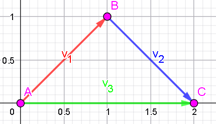
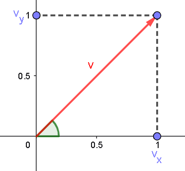
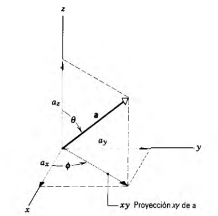

# Clase 02 - Vectores

**Fecha:** 04-02-2026
**Estado:** 🟢 Completado

## Resumen en 3 líneas

En esta clase aprendemos lo que es un vector, para que sirve en particular en la física. Entre otras cosas, aprendemos:

- a sumar vectores gráficamente,
- a separar los vectores en sus componentes (coordenadas),
- a separar los vectores en módulo y ángulo
- a sumar vectores analíticamente usando sus componentes 

## Preguntas Clave

- Qué utilidad tienen los vectores en la física?
- Cómo es el proceso para sumar dos vectores gráficamente?
- Cuáles son las dos formas principales de representar un vector analíticamente?
- Cómo se suman dos vectores usando su representación analítica?

## Contenido

### Vectores y escalares

Al cambio de posición de una particula lo llamamos desplazamiento. Si una particula se mueve desde una posición $A$ a una posición $B$, podemos representar el desplazamiento con una línea entre $A$ y $B$. La dirección del desplazamiento la podemos representar dibujando una punta de flecha en $B$ para indicar que el desplazamiento fue de $A$ hacia $B$.
Es importante notar que la trayectoria de la partícula no necesariamente es una línea recta de $A$ a $B$; la flecha representa sólo el efecto néto del movimiento, no el movimiento real.

Notemos que en el ejemplo tenemos que el efecto neto del desplazamiento de $A$ hasta $C$ es el mismo que el de los desplazamientos de $A$ hasta $B$ y luego de $B$ hasta $C$. Hablamos entonces de $AC$ como la suma o resultante de los desplazamientos $AB$ y $BC$; expandiremos un poquito más adelante sobre esto.
Resumiendo, los vectores son cantidades que tienen tanto magnitud como dirección. Algunas cantidades físicas que se representan por vectores son: fuerza, velocidad, campo eléctrico, y campo magnético.

Por otra parte, hay cantidades que se pueden representar solamente con un número y una unidad, es decir que estas cantidades solo tienen magnitud; a estas cantidades las llamamos **escalares**. Algunas cantidades físicas escalares son: masa, longitud, tiempo, densidad, energía y temperatura. Los escalares pueden ser manípulados por las reglas del álgebra ordinaria.

### Suma de vectores: método gráfico

Para representar un vector en un diagrama trazamos una flecha. Elegimos que la longitud de la flecha sea proporcional a la magnitud del vector (esto lo hacemos eligiendo una escala), y elegimos que la dirección de la flecha sea la dirección del vector.
Representamos un vector por una letra y el símbolo de una flecha por encima, así: $\vec{v}$. A veces sin embargo solo nos interesa la magnitud (o longitud) del vector, a ésta la representamos como $|v|$ o a menudo simplemente $v$.

Consideremos ahora la primera imágen que vimos en esta clase. Tenemos una relación entre los vectores por:

- $\vec{v_1}+\vec{v_2}=\vec{v_3}$

Paso a paso, para sumar los vectores y obtener $\vec{v_3}$ tenemos que:

1. Dibujar $\vec{v_1}$ a escala en un sistema de coordenadas con su dirección propia.
2. Dibujar $\vec{v_2}$ a escala empezando en la punta (donde dibujamos la flecha) de $\vec{v_1}$, asegurándonos de que $\vec{v_2}$ tiene su dirección propia.
3. Dibujamos una linea desde el origen de $\vec{v_1}$ hasta la punta de $\vec{v_2}$, obteniendo $\vec{v_3}$.

Este procedimiento se llama la regla del paralelogramo y se puede generalizar para cualquier cantidad de vectores.
Podemos ver fácilmente que la suma de vectores tiene las siguientes propiedades básicas:

- $\vec{a}+\vec{b}=\vec{b}+\vec{a}$ (conmutatividad)
- $\vec{a}+(\vec{b}+\vec{c})=(\vec{a}+\vec{b})+\vec{c}$ (asociatividad)

Por otra parte, definiendo el opuesto de un vector $\vec{v}=-\vec{v}$ como otro vector de igual magnitud pero dirección opuesta podemos incluir la resta en nuestra álgebra vectorial:

- $\vec{a}-\vec{b}=\vec{a}+(-\vec{b})$

### Componentes de vectores

Aún habiendo definido la suma de vectores usando un método gráfico, la intuición analítica suele ser muy útil para casos donde nuestra "idea" gráfica deja de funcionar tan bien, cómo en tres dimensiones.

Al dibujar el vector $\vec{v}$ en un plano con coordenadas, lo podemos descomponer en sus partes en el eje $x$ y en el eje $y$ respectivamente por $v_x$ y $v_y$ al trazar una línea perpendicular a los ejes desde la punta del vector.

Considerando el ángulo $\phi$ que forma el vector $\vec{v}$ con el eje $x$, podemos obtener sus componentes por:

- $v_x=|v|\cos\phi$
- $v_y=|v|\sin\phi$

Por lo que básicamente tenemos dos representaciones:

- Módulo y ángulo, o
- Coordenadas cartesianas

Por el gráfico podemos observar también lo siguiente; esto nos permitirá pasar de una representación a otra según nuestra conveniencia:

- $|v|=\sqrt{v_x^2+v_y^2}$
- $\tan(\phi)=\frac{v_y}{v_x}$

En tres dimensiones las cosas se complican un poco, pero se trabaja de forma similar: es decir que dibujamos líneas perpendiculares desde la punta del vector hacia los tres ejes de coordenadas $x,y$ y $z$. En la siguiente figura podemos ver como se hace con una representación gráfica.

De esta figura, podemos obtener una expresión para las componentes del vector, obteniendo:

- $a_x=|a|\sin\theta\cos\phi$
- $a_y=|a|\sin\theta\sin\phi$
- $a_z=|a|\cos\theta$

**Nota:** Recordemos lo siguiente, que es fundamental para entender el porque de estas expresiones:

- $hip\cdot\sin\theta=op$
- $hip\cdot\cos\theta=adj$

Muchas veces cuando trabajamos con vectores es conveniente introducir vectores de longitud unitaria en una dirección determinada (concepto de base en GAL). En el sistema de coordenadas rectangulares se utilizan los símbolos $\hat{i},\hat{j},\hat{k}$ para los ejes $x,y,z$ respectivamente.
De este modo, un vector $\vec{a}$ en un sistema de coordenadas tridimensional puede escribirse como:

- $\vec{a}=a_x\hat{i}+a_y\hat{j}+a_z\hat{k}$

### Suma de vectores: método de las componentes

Ahora que sabemos resolver vectores en sus componentes, podemos considerar la suma de vectores por un método analítico.
Sea $s$ la suma de los vectores $a$ y $b$, o $s=a+b$.

Si dos vectores, tales como $s$ y $a+b$ son iguales, entonces su magnitud y dirección deben ser iguales también. Esto solo puede suceder si sus componentes correspondientes también son iguales.
Por lo tanto, considerando nuestro desarrollo analítico tenemos que:

$$
\begin{aligned}
&s=a+b\\
&=\scriptstyle{(\text{desarrollo con vectores unitarios})}\\
&s_x\hat{i}+s_y\hat{j}=a_x\hat{i}+a_y\hat{j}+b_x\hat{i}+b_y\hat{j}\\
&=\scriptstyle{(\text{agrupando por componente})}\\
&s_x\hat{i}+s_y\hat{j}=(a_x+b_x)\hat{i}+(a_y+b_y)\hat{j}\\
\end{aligned}
$$

Por lo tanto podemos concluir que:

$$
\begin{cases}
s_x=a_x+b_x\\
s_y=a_y+b_y\\
\end{cases}
$$

Por otra parte, también podemos expresar el vector $\vec{s}$ usando su módulo y ángulo:

- $|s|=\sqrt{s_x^2+s_y^2}=\sqrt{(a_x+b_x)^2+(a_y+b_y)^2}$
- $\tan\phi=\frac{s_y}{s_x}=\frac{a_y+b_y}{a_x+b_x}$

Este método tiene la ventaja de que se puede generalizar cuando trabajamos con más dimensiones, y nos evita la confusión que puede generar el imaginar la situación en el espacio.