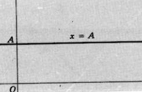
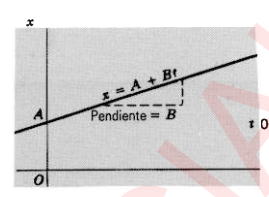
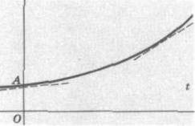
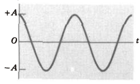
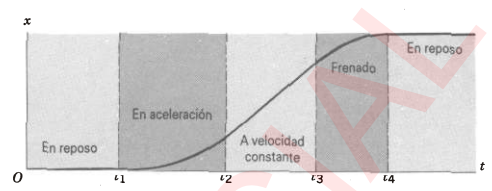
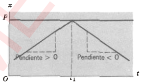
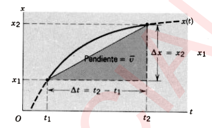

# Clase 03 - Movimiento unidimensional

**Fecha:** 23-03-2026
**Estado:** 🟢 Completado

## Resumen en 3 líneas

## Preguntas Clave

## Contenido

### Cinemática de la partícula

Para iniciar el estudio de la cinemática, elegimos un caso simple: una partícula que se mueve en línea recta. Esto nos permite introducir alguno de los conceptos más básicos de la cinemática como la velocidad y la aceleración, sin la complejidad matemática que introducen los vectores, los cuales se usan con frecuencia para analizar el movimiento bidimensional y tridimensional.
Tengamos en cuenta que el **estado** del movimiento puede cambiar (por ejemplo: un disco de goma utilizado en el hockey debe ser golpeado antes de que se deslice) y su **dirección** puede cambiar (por ejemplo: un piedra puede ser arrojada hacia arriba antes de que caiga), pero el movimiento debe ser confinado a una sola línea.
También simplificaremos esta exposición considerando el movimiento de una partícula únicamente. Esto es, tratamos a un objeto complejo como un simple punto de masa. Esto nos permite despreciar todos los movimientos internos posibles, por ejemplo, el movimiento de rotación interno del objeto (que consideraremos más adelante en el curso), o la vibración de sus partes (que también consideraremos más adelante en el curso).

Para el caso que nos ocupa, todas las partes del objeto se mueven exactamente de la misma manera. El giro de una rueda, no satisface esta restricción, pues un punto de la llanta se mueve de una forma diferente a un punto del eje. Por otra parte el deslizamiento si satisface esta restricción.
Entonces esto nos dice que algunos objetos se pueden considerar como una partícula en ciertos cálculos pero no en otros.

Dentro de estas limitaciones, consideraremos todos los tipos de movimientos posibles. Las partículas pueden acelerar, decelerar, e incluso detener e invertir su movimiento. Buscaremos una descripción del movimiento que incluya cualquiera de estas posibilidades.

### Descripción del movimiento

Describiremos el movimiento de una partícula de dos maneras: con ecuaciones matemáticas y con gráficas.
Podemos obtener una descripción completa del movimiento de una partícula si conocemos la dependencia matemática de su posición $x$ (relativa a un origen elegido) en el tiempo $t$ en todo momento. Ésta es precisamente la función $x(t)$, veamos algunos ejemplos de posibles funciones y las gráficas que las describen.

1. **Ningún movimiento en absoluto**. Este es el caso más simple, la partícula ocupa la posición inicial $A$ todo el tiempo:

    - $x(t)=A$

    Veamos la gráfica que representa este "movimiento":

    

2. **Movimiento a velocidad constante**. La razón de movimiento de una partícula se describe por su velocidad. En el movimiento unidimensional, la velocidad puede ser o bien positiva, si la partícula se mueve en la dirección en que $x$ crece, o bien negativa, si la partícula se mueve en la dirección opuesta. Otra medida de la razón de movimiento de una partícula es la magnitud de su velocidad, ésta es siempre positiva y no conlleva información adicional. El gráfico para este tipo de movimiento es una recta con pendiente constante, la ecuación que representa este movimiento es como podemos deducir:

    - $x(t)=A+Bt$

    Y como aprendimos en cálculo, sabemos que la pendiente de la función nos habla de su **cantidad de cambio**. Aquí la cantidad de cambio de la posición es la velocidad, y cuánto más acentuada sea la pendiente de la gráfica, mayor será la velocidad.

    

3. **Movimiento acelerado**. En este caso, la velocidad va cambiando (la aceleración se define como la razón de cambio de la velocidad), y por lo tanto la pendiente cambiará también.
Por lo tanto gráficamente ya no serán rectas, sino más bien curvas. Dos ejemplos son:

    - $x(t)=A+Bt+Ct^2$
    - $x(t)=A\cos(\omega t)$

    
    

    Notemos que este tipo de movimiento puede tener gráficas bastante más variadas que el caso anterior, pues la pendiente puede variar en cada punto, mientras que en el caso anterior se mantiene fija.

4. **Acelerado y frenado de un automóvil**. Un automóvil parte del reposo hasta determinada velocidad. Luego se mueve durante un tiempo a velocidad constante, después del cual se aplican los frenos, trayendo al automóvil de nuevo al reposo. Veamos una gráfica que representa al movimiento.

    

    Notemos que ninguna expresión matemática representa exactamente al movimiento, sin embargo si somos capaces de describir el movimiento entre cada uno de los fragmentos de tiempo (utilizando las ecuaciones que vimos desde el tipo de movimiento 1 hasta el 3).
    Otras observaciones importantes son que: el gráfico corresponde a una función continua, pues si no fuera así, entonces el automóvil hubiera desaparecido en un punto y aparecido en otro. Por otra parte, no hay puntos agudos. Como veremos más adelante, estos puntos indican que la velocidad cambia instantáneamente de un valor a otro.

5. **Rebote de un disco de goma**. Un disco de goma de los que se usan en el hockey se desliza por el hielo a velocidad constante, choca con la pared, y luego rebota en dirección opuesta con la misma velocidad. Veamos como se ve gráficamente este movimiento.

    

### Velocidad promedio

Si el movimiento de una partícula siempre estuviera descrito por gráficas como las que vimos en el caso 1 y 2, no tendríamos problema en obtener la velocidad en cualquier intervalo de tiempo: es constante e igual a la pendiente de la recta. En casos más complicados como los que estudiamos desde el 3 hasta el 6, donde la velocidad cambia, es conveniente definir la velocidad media o velocidad promedio $\overline{v}$ (una barra sobre el símbolo en cualquier cantidad física indica un valor promedio de esa cantidad).

Supongamos que la partícula está en un punto $x_1$ en el tiempo $t_1$, y luego se mueve hasta el punto $x_2$ en el tiempo $t_2$. La velocidad promedio en el intervalo se define por:

- $\overline{v}=\frac{x_2-x_1}{t_2-t_1}=\frac{\Delta x}{\Delta t}$

