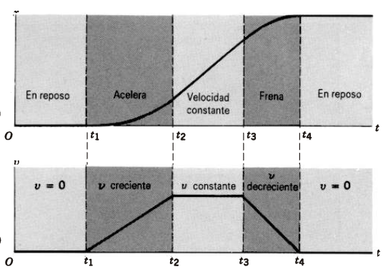
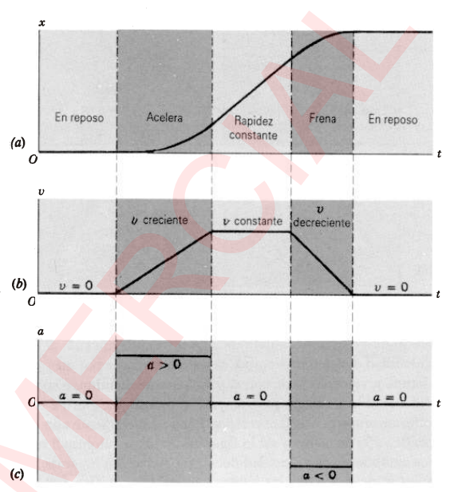
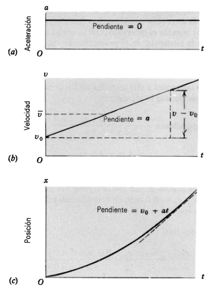

# Clase 04 - Movimiento unidimensional

**Fecha:** 24-03-2026

## Velocidad instantánea

La velocidad promedio puede ser útil al considerar el comportamiento total del movimiento de una partícula, pero para describir los detalles del movimiento no es particularmente útil. Sería más apropiado tener una función $v(t)$, la cual da la velocidad en cualquier punto durante el movimiento.
Ésta es la velocidad instantánea; de ahora en adelante, cuando usemos el término velocidad entendemos que significa velocidad instantánea.

Para calcularla lo que hacemos es bastante sencillo; supongamos que queremos calcular la velocidad promedio en un intervalo $\Delta t$ que se vuelve cada vez más pequeño. En este caso límite donde $\Delta t\to0$, la línea que une a los puntos extremos del intervalo se aproxima a la tangente de la curva $x(t)$ en un punto, y la velocidad promedio se aproxima a la pendiente de $x(t)$, la cual define la velocidad instantánea para este punto:

- $v=\lim_{\Delta t\to0}\frac{\Delta x}{\Delta t}$

Lo que tenemos en esta ecuación se puede simplificar introduciendo el concepto de derivada de cálculo:

- $v=\frac{dx}{dt}$

Con esto, dada cualquier función $x(t)$, podemos hallar $v(t)$ diferenciando. Gráficamente, podemos evaluar (punto por punto) la pendiente de $x(t)$ para trazar $v(t)$. Revisemos ahora los ejemplos que vimos en la clase anterior para determinar cuál sería la función $v(t)$.

1. **Ningún movimiento en absoluto**. Recordemos que la función posición era $x(t)=A$, entonces:

    - $v(t)=\frac{dx}{dt}=0$

2. **Movimiento a velocidad constante**. Recordemos que la función posición era $x(t)=A+Bt$, entonces:

    - $v(t)=\frac{dx}{dt}=\frac{d}{dt}(A+Bt)=B$

3. **Movimiento acelerado**. Recordemos una de las posibles funciones posición $x(t)=\frac{dx}{dt}=\frac{d}{dt}(A+Bt+Ct^2)=B+2Ct$

4. **Un automóvil que acelera y frena**. Acá tenemos la leve complicación de que no tenemos una función $x(t)$ que represente a todo el movimiento. Pero con la misma idea que en la clase anterior, podemos separar según las acciones que realiza el automóvil en las distintas franjas de tiempo.
Por ejemplo, cuando el automóvil está en reposo, corresponde a lo que estudiamos en la parte 1, por lo que $v(t)=0$ para los $t$ en esta franja.
Por otra parte, cuando el automóvil acelera, tenemos un comportamiento como estudiamos en la parte 3, por lo tanto $v(t)$ tiene la forma que vimos en esa sección. Esto vale para todas las franjas de tiempo, por lo que el gráfico resultante es:

    

El razonamiento es similar para las demás

## Movimiento acelerado

Como ya hemos visto, la velocidad de una partícula puede cambiar con el tiempo según procede el movimiento. Este cambio de velocidad con el tiempo se llama **aceleración**. De forma similar a como lo hicimos con la velocidad promedio, podemos hacer lo mismo para la aceleración por el cambio en velocidad $\Delta v$ en el intervalo $\Delta t$:

- $\overline{a}=\frac{\Delta v}{\Delta t}$

La aceleración tiene unidades de velocidad divididas entre unidades de tiempo, por ejemplo, metros por segundo por segundo.
Como fue en el caso con la velocidad promedio $\overline{v}$, la aceleración promedio $\overline{a}$ no nos dice nada acerca de la variación de $\overline{v}(t)$ con $t$ en el intervalo $\Delta t$. Como vimos en la definición, solo depende del cambio neto de velocidad durante el intervalo.

Si $\overline{a}$ es evaluada como una constante cualquier intervalo $\Delta t$ del mismo tamaño, entonces podemos concluir que tenemos una aceleración constante. En este caso, el cambio de velocidad es el mismo en cualquier intervalo $\Delta t$ del mismo tamaño.
Si el cambio de velocidad no es el mismo en todos los intervalos $\Delta t$ del mismo tamaño, entonces tenemos un caso de aceleración variable. En tales casos conviene definir la aceleración instantánea:

- $a=\lim_{\Delta t\to0}\frac{\Delta v}{\Delta t}=\frac{dv}{dt}$

Es importante tener en cuenta que la aceleración puede ser positiva o negativa independientemente de si $v$ es positiva o negativa. La aceleración $a$ da el cambio de velocidad; el cambio puede ser un aumento o una disminución para una velocidad ya sea positiva o negativa.
Veamos esto con el ejemplo del automóvil que ya revisitamos varias veces:

## Movimiento con aceleración constante

Es bastante común encontrar movimientos con aceleración constante (o casi constante). Veremos en esta sección algunos resultados útiles para este caso especial. Tengamos presente que no sirven cuando la aceleración no es constante.
Estudiaremos el siguiente gráfico para deducir algunos resultados para este caso especial:

Supongamos que $a$ representa la aceleración constante representada en el primer gráfico. Como $a$ es constante, las aceleraciones promedio e instantáneas son idénticas.
Consideremos un objeto que arranca con una velocidad $v_0$ en un tiempo inicial $0$ y en un tiempo $t$ posterior tiene una velocidad $v$. Entonces la ecuación que conocemos para $a$ en este intervalo de tiempo resulta en:

- $a=\frac{\Delta v}{\Delta t}=\frac{v-v_0}{t}\implies v=v_0+at\quad(*_1)$

Este resultado es importante, ya que nos permite calcular la velocidad para todos los tiempos posteriores. Además nos da una expresión para la función $v(t)$, que tiene la forma de $y=mx+b$ que describe la gráfica de una línea recta.
Para completar el análisis de la cinemática de la aceleración constante, debemos hallar una expresión para la función posición $x(t)$ en el tiempo. Para esto necesitamos una expresión para la velocidad promedio en el intervalo (pues su definición contiene información sobre la posición).
Como la gráfica de $v$ es una línea recta, sabemos que el valor medio de $v$ ocurre a medio camino a través del intervalo. Esto deriva en:

- $\overline{v}=\frac{1}{2}(v+v_0)$, y reemplazando $v$ con $*_1$
- $\overline{v}=v_0+\frac{1}{2}at\quad(*_2)$

Ahora utilizando la definición de velocidad promedio en la ecuación $*_2$ tenemos que:

- $\overline{v}=\frac{\Delta x}{\Delta t}=\frac{x-x_0}{t-0}$, y juntando con $*_2$
- $v_0+\frac{1}{2}at=\frac{x-x_0}{t}\implies x=x_0+v_0t+\frac{1}{2}at^2$

Se pueden derivar algunas expresiones más según cuales son las variables que nos faltan, pero no es necesario expandir esto acá ya que las más usadas son las que exploramos acá.