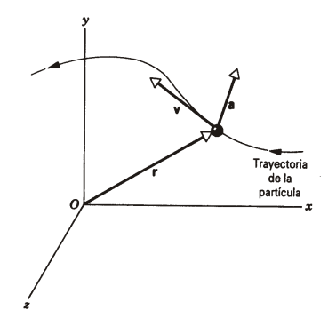
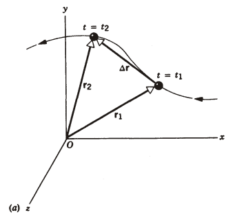
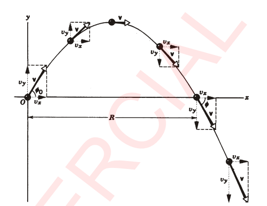

# Clase 05 - Movimiento bidimensional y tridimensional

**Fecha:** 27-03-2026

## Introducción

En las siguientes dos clases continuaremos describiendo el movimiento de una partícula en términos de su posición, velocidad y aceleración, como lo hicimos en las clases anteriores. Sin embargo, ahora eliminaremos la restricción impuesta de que la partícula se mueve solo en línea recta.

## Posición, velocidad y aceleración

La figura muestra una partícula que se mueve en el tiempo $t$ en una trayectoria curva de tres dimensiones. Su posición (o desplazamiento desde el origen) está medida por el vector $\vec{r}$. La velocidad está indicada por el vector $\vec{v}$, el cual como demostraremos enseguida debe ser tangente a la trayectoria de la partícula (lo cual es muy lógico ya que diferenciamos al igual que en el caso de una dimensión). La aceleración está indicada por el vector $\vec{a}$, cuya dirección no guarda ninguna relación única con la posición de la partícula o la dirección de $\vec{v}$.

En coordenadas cartesianas, la partícula se localiza por sus componentes $x,y,z$, las cuales nos dan su vector posición.

- $r=x\hat{i}+y\hat{j}+z\hat{k}$

Supongamos que la partícula se mueve de una posición $r_1$ en el tiempo $t_1$ a otra posición $r_2$ en el tiempo $t_2$, como se muestra en la siguiente figura:

Entonces, su desplazamiento en el intervalo $\Delta t=t_2-t_1$ es la resta de vectores $\Delta r=\vec{r_2}-\vec{r_1}$. Y la velocidad promedio en $\Delta t$ está dada por:

- $\overline{v}=\frac{\Delta r}{\Delta t}$

Es importante observar que a medida que el intervalo $\Delta t$ se hace más pequeño, más se parece $\Delta r$ a la trayectoria real de la partícula.
Entonces en el límite cuando $\Delta t\to0$, la velocidad promedio tiende a la velocidad instantánea $v$.

- $v=\lim_{\Delta t\to0}\frac{\Delta r}{\Delta t}$

Extendiendo lo que vimos para casos unidimensionales, podemos tomar el diferencial de $r$ para reescribir el resultado.

- $v=\frac{dr}{dt}\quad(*_1)$

**Nota:** Deja atrás bastantes detalles esta definición, lo importante es llevarlo a lo que hicimos en una dimensión, tomar el diferencial de $r$ cuando $r$ es un vector es raro. Por eso tenemos que interpretar (al igual que el caso de una dimensión) a $r$ como una función de varias variables que devuelve el vector posición para cualquier tiempo $t$.

De igual forma que $\Delta r$ en el límite $\Delta t\to0$, el vector $v$ es tangente a la trayectoria de la partícula en cualquier punto del movimiento.
La ecuación $*_1$ al desarrollarse con un enfoque de cálculo en varias variables, utiliza los conceptos de las funciones coordenadas, veamos que sucede cuando escribimos $v=v_xi+v_yj+v_zk$:

$$
\begin{aligned}
&v_xi+v_yj+v_zk=\frac{d}{dt}(xi+yj+zk)\\
&\iff\scriptstyle{(\text{derivadas de funciones coordenada})}\\
&v_xi+v_yj+v_zk=\frac{dx}{dt}i+\frac{dy}{dt}j+\frac{dz}{dt}k\\
\end{aligned}
$$

Por lo tanto, tenemos que:

$$
\begin{aligned}
v_x=\frac{dx}{dt},\quad
v_y=\frac{dy}{dt},\quad
v_z=\frac{dz}{dt}
\end{aligned}
$$

Es decir que nos resolvemos con tener las funciones coordenadas de la función desplazamiento.

El razonamiento para la aceleración es análogo a lo que hicimos en el capítulo anterior, sumando los mismos razonamientos que vimos para la velocidad. Entonces la aceleración promedio es:

- $\overline{a}=\frac{\Delta v}{\Delta t}$

La aceleración instantánea se obtiene de la misma forma que la velocidad, haciendo tender $\Delta t\to0$:

- $a=\lim_{\Delta t\to0}\frac{\Delta v}{\Delta t}$

Expresando con derivadas:

- $a=\frac{dv}{dt}$

Separando por componentes:

$$
\begin{aligned}
a_x=\frac{dv_x}{dt},\quad
a_y=\frac{dv_y}{dt},\quad
a_z=\frac{dv_z}{dt}
\end{aligned}
$$

Habiendo terminado la extensión a varias dimensiones, lo que tenemos que tener presente es que un cambio en la dirección de la velocidad puede producir una aceleración aún si la magnitud no cambia. Entonces el movimiento a velocidad constante puede ser un movimiento acelerado como veremos en el caso del movimiento circular uniforme (por ejemplo).

## Movimiento con aceleración constante

Consideraremos ahora el caso especial del movimiento con aceleración constante. Al moverse la partícula $\vec{a}$ no varía ni en magnitud ni en dirección, por lo tanto sus componentes $a_x,a_y,a_z$ tampoco varían.
Fijando entonces las componentes de $\vec{a}$ para que no cambien, podemos obtener las ecuaciones generales para el movimiento.

La partícula comienza en $t=0$ con una posición inicial $r_0=x_0i+y_0j+z_0k$ y una velocidad inicial $v_0=v_{x_0}i+v_{y_0}j+v_{z_0}k$. Procediendo como hicimos en el capítulo anterior, tenemos la siguiente ecuación vectorial:

- $\vec{v}=\vec{v_0}+\vec{a}t$

De esta se desprenden varias ecuaciones más que tienen utilidad según que variable tengamos que encontrar:

1. $r=r_0+v_0t+\frac{1}{2}at^2$
2. $r=r_0+\frac{1}{2}(v_0+v)t$
3. $r=r_0+vt-\frac{1}{2}at^2$

Además en esta sección del libro se estudia un ejemplo, vamos a saltearlo para estas notas con la intención de trabajar con los ejemplos del práctico.

### Movimiento de proyectiles

Un ejemplo de movimiento con aceleración constante es el movimiento de un proyectil. Se trata del movimiento bidimensional de una partícula lanzada oblicuamente en el aire. El movimiento ideal de una pelota de béisbol o de una pelota de golf es un ejemplo del movimiento de un proyectil. 
Suponemos por ahora que podemos despreciar el efecto del aire, aunque más adelante en el curso lo empezaremos a considerar.

El movimiento de un proyectil es aquel de aceleración constante $g$, dirigido hacia abajo. Aún cuando puede haber una componente horizontal de la velocidad, no hay una componente horizontal de la aceleración. Si consideramos un sistema de coordenadas con el eje $y$ positivo verticalmente hacia arriba, entonces tenemos que $a_y=-g$ y además $a_x=0$. Suponemos también que $v_0$ se encuentra en el plano $xy$, por lo que ${v_0}_z=0$. Puesto que $a_z=0$ también, la ecuación $v=v_0+at$ nos dice que $v_z=0$ en todo momento del movimiento, por lo que centraremos nuestra atención en el plano $xy$.

Continuando con más decisiones que tomaremos para resolver el problema, elegiremos el punto de partida del proyectil como el origen, por ejemplo el momento en el que la pelota deja la mano del lanzador, entonces $x_0=y_0=0$.
La velocidad en $t=0$, el instante en que el proyectil comienza su vuelo, es $v_0$, que forma un ángulo $\phi_0$ con la dirección $x$ positiva. Entonces las componentes de $v_0$ son:

- ${v_0}_x=|v_0|\cos\phi_0$
- ${v_0}_y=|v_0|\sin\phi_0$

Como no tenemos una componente horizontal de la aceleración, la componente horizontal de la velocidad es constante, por lo que *la componente horizontal de la velocidad retiene su valor inicial*. Esto sucede por lo siguiente:

- $v_x={v_x}_0+a_xt=|v_0|\cos\phi_0$

Usando la misma ecuación para expandir sobre $v_y$ (recordando que $a_y=-g$):

- $v_y={v_y}_0+a_yt=|v_0|\sin\phi_0-gt$

Podemos obtener la magnitud y el ángulo del vector velocidad en cualquier instante por las siguientes ecuaciones:

- $v=\sqrt{v_x^2+v_y^2}$
- $\tan\theta=\frac{v_y}{v_x}$

Por otra parte (recordando que $x_0=0,y_0=0,a_x=0$), para las coordenadas $x,y$ de la posición de la partícula en cualquier instante tenemos que:

- $x=x_0+{v_x}_0t+\frac{1}{2}a_xt^2=(|v_0|\cos\phi_0)t$
- $y=y_0+{v_y}_0t+\frac{1}{2}a_yt^2=(|v_0|\sin\phi_0)t-\frac{1}{2}gt^2$

Combinando a estas dos ecuaciones y eliminando a $t$ obtenemos la ecuación que define la trayectoria del proyectil:

- $y=(\tan\phi_0)x-\frac{g}{2(|v_0|\cos\phi_0)^2}x^2\quad(*_1)$

Que además es una ecuación de la forma $y=ax+bx^2$, de ahí el hecho de que la trayectoria sea parabólica.

Se define también el alcance horizontal del proyectil $R$ como la distancia a lo largo de la horizontal hasta que el proyectil retorna al nivel desde el cual fue lanzado. Este se halla simplemente sustituyendo $y$ por $0$ en la ecuación $*_1$, tendremos dos soluciones, la primera es cuando $x=0$ (que es la posición inicial), y la otra es el alcance horizontal:

- $R=\frac{2v_0^2}{g}\sin\phi_0\cos\phi_0$

Y usando la identidad trigonométrica $2\theta=2\sin\theta\cos\theta$ tenemos que:

- $R=\frac{v_0^2}{g}\sin(2\phi_0)$

Con esto concluimos la sección de movimiento de proyectiles.