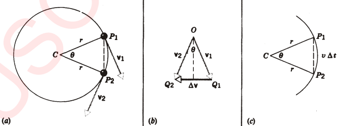
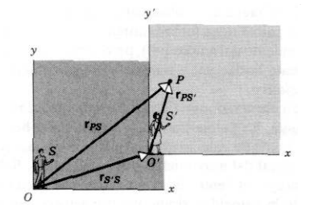

# Clase 06 - Movimiento circular y movimiento relativo

**Fecha:** 31-03-2026

## Movimiento circular uniforme

En el movimiento de proyectiles la aceleración es constante tanto en magnitud como dirección, pero la velocidad cambia tanto en magnitud como dirección.
Examinaremos ahora el caso especial en que una partícula se mueve a **velocidad constante** en una trayectoria circular. Como veremos, tanto la velocidad como la aceleración son de magnitud constante, pero ambas cambias de dirección constantemente. Esta situación se llama movimiento circular uniforme, un ejemplo de la vida real podrían ser por ejemplo los satélites de la Tierra. Veamos una figura que representa un ejemplo de este movimiento.

Sea $P_1$ la posición de la partícula en el tiempo $t_1$ y $P_2$ su posición en el tiempo $t_2=t_1+\Delta t$. La velocidad en $P_1$ es $v_1$, tangente a la curva en ese punto. Lo mismo vale para $v_2$ en $P_2$. Ambos vectores $v_1,v_2$ tienen la misma magnitud $v$, ya que la velocidad es constante, pero diferentes direcciones.
La longitud de la trayectoria descrita durante $\Delta t$ es la del arco $P_1P_2$, por lo tanto igual a $r\theta$ (con $\theta$ en radianes) y también a $v\Delta t$ (movimiento de velocidad constante). Entonces tenemos que:

- $r\theta=v\Delta t\quad(*_1)$

Podemos trazar los vectores $v_1$ y $v_2$ como en la parte $b$ de la figura anterior, de modo que se originen en un punto común. Podemos hacerlo mientras mantengamos el módulo y dirección de los originales.
Este dibujo nos permite ver claramente el cambio de velocidad entre los vectores, siendo este $v_2-v_1=\Delta v$. Ahora, notemos que el triángulo $OQ_1Q_2$ (figura b) es semejante al triángulo $CP_1P_2$ (figura a y c).
Con esto, considerando la figura $b$, al trazar la bisectriz del ángulo $\theta$ tenemos que:

- $\frac{1}{2}\Delta v=v\cdot\sin\frac{\theta}{2}\quad(*_2)$

Con las dos ecuaciones que vimos hasta ahora, podemos calcular la aceleración promedio:

$$
\begin{aligned}
\overline{a}&=\frac{\Delta v}{\Delta t}\\
&=\Delta v\cdot\frac{1}{\Delta t}\\
&=\left(2v\sin(\theta/2)\right)\cdot\left(\frac{v}{r\theta}\right)\\
&=\frac{2v^2\sin(\theta/2)}{r\theta}\\
&=\frac{v^2}{r}\cdot\frac{2\sin(\theta/2)}{\theta}\\
&=\frac{v^2}{r}\cdot\frac{\sin(\theta/2)}{\theta/2}\\
\end{aligned}
$$

Con esta información, nos gustaría hallar la aceleración instantánea, por lo que queremos hacer tender la expresión a cuando $\Delta t\to0$. Notemos que cuando esto sucede, tenemos que el ángulo $\theta$ es muy pequeño; y cuando $x\sim0$ entonces $\sin x\sim x$ (es importante entender que esto solo vale para cuando $x$ está expresado en radianes). Entonces, desarrollando tenemos que:

$$
a=\lim_{\Delta t\to0}\frac{\Delta v}{\Delta t}=\lim_{\Delta t\to0}\frac{v^2}{r}\cdot\frac{\sin(\theta/2)}{\theta/2}=\frac{v^2}{r}\cdot\lim_{\Delta t\to0}\frac{\sin(\theta/2)}{\theta/2}
$$

Por lo tanto, usando la aproximación por Taylor, llegamos a que:

- $a=\frac{v^2}{r}$

La aceleración $a$ siempre está dirigida hacia el centro del círculo o del arco circular en el que se mueve la partícula, por esto se le llama la **aceleración centrípeta**.

## Movimiento regular

Supongamos que vamos en un automóvil que corre en una carretera recta a una velocidad constante de $55km/h$. Los demás pasajeros que van con nosotros se mueven a la misma velocidad; aún cuando ésta, con relación al terreno, es de $55km/h$, su velocidad con respecto a la nuestra es cero.

En esta sección consideraremos la descripción del movimiento de una sola partícula vista por dos observadores que están en movimiento uniforme entre si. Los dos observadores pudieran ser, por ejemplo, una persona en un automóvil que viaja a velocidad constante y otra persona que está parada en el piso. La partícula que están observando pudiera ser por ejemplo una bola arrojada en el aire.
Llamaremos $S$ y $S'$ a estos observadores, y es importante considerar que cada uno tiene un marco de referencia correspondiente, que está determinado por un sistema de coordenadas cartesianas. Por conveniencia vamos a considerar que ambos los observadores están en el origen de sus respectivos sistemas de coordenadas. Hacemos una sola restricción: *la velocidad relativa entre $S$ y $S'$ es constante en magnitud y dirección*.

Veamos un ejemplo, que muestra en un tiempo particular $t$, los dos sistemas de coordenadas que pertenecen a $S$ y $S'$. Con el fin de simplificar este tema, consideraremos el movimiento solo en dos dimensiones. los planos comunes $xy$ y $x'y'$ que se muestran en la figura.

El origen del sistema $S'$ está marcado por el vector $r_{S'S}$. El órden de los subíndices es importante para marcar el vector: el primer subíndice indica el sistema en el que está siendo ubicado (en este caso, el sistema de coordenadas de $S'$) y el segundo subíndice indica el sistema con respecto al cual hacemos la ubicación (en este caso, el sistema de coordenadas de $S$). El vector $r_{S'S}$ se leería entonces como "la posición de $S'$ con respecto al sistema de coordenadas $S$".

Por otra parte, la figura también muestra a una partícula $P$. Tanto $S$ como $S'$ ubican a la partícula con respecto a sus sistemas de coordenadas. De acuerdo con $S$, la posición de la partícula está dada por $r_{PS}$, mientras que para $S'$ está dada por $r_{PS'}$. Además la figura muestra muy claramente la relación entre los tres vectores que mencionamos:

- $r_{PS}=r_{S'S}+r_{PS'}\quad(*_1)$

Supongamos que la partícula $P$ se mueve con velocidad $v_{PS'}$ de acuerdo con $S'$. Que velocidad de la partícula mediría $S$? Para esto bastaría derivar la expresión anterior con respecto al tiempo, por lo que:

- $\frac{dr_{PS}}{dt}=\frac{dr_{S'S}}{dt}+\frac{dr_{PS'}}{dt}$

Y como la razón de cambio de la posición de cada vector da la velocidad correspondiente:

- $v_{PS}=v_{S'S}+v_{PS'}\quad(*_2)$

La ecuación $*_2$ es una *ley de transformación de velocidades*. Nos permite transformar una medición de velocidad hecha por un observador en un marco de referencia $S'$ en otro marco $S$, siempre y cuando conozcamos la velocidad relativa entre los dos marcos de referencia.
Ahora consideraremos el caso muy especial en el que los dos marcos de referencia se están moviendo a velocidad constante uno con respecto al otro. Esto significa que $v_{S'S}$ es constante tanto en módulo como en dirección.
Un resultado muy significativo para este caso, es obtenido al diferenciar la ecuación $*_2$:

- $\frac{dv_{PS}}{dt}=\frac{dv_{S'S}}{dt}+\frac{dv_{PS'}}{dt}$

Y como $v_{S'S}$ es constante, tenemos que $\frac{dv_{S'S}}{dt}=0$, por lo que:

- $a_{PS}=a_{PS'}$

Por lo que las aceleraciones medidas por las dos observaciones son idénticas.