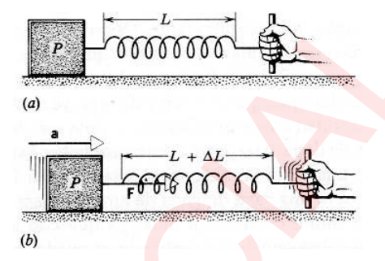

# Clase 07 - Fuerza y las leyes de Newton

**Fecha:** 08-04-2026

## Introducción

En las clases anteriores centramos nuestra atención en el movimiento de una partícula. No nos preguntabamos entonces que es lo que causaba el movimiento; simplemente lo describíamos en función de los vectores $r,v$ y $a$. En este capítulo y en el próximo, discutiremos las causas del movimiento, un campo de estudio llamado **dinámica**.
El enfoque que vamos a considerar, recibe el nombre de mecánica clásica, fue desarrollada y éxitosamente probada en los siglos XVII y XVIII.

## Mecánica clásica

Vamos a fijarnos en el movimiento de un cuerpo en particular. Éste interactúa con los cuerpos que lo rodean (su entorno) de modo que su velocidad cambia: se produce una aceleración.
El problema central de la mecánica clásica es éste:

1. Se nos da un cuerpo cuyas características (masa, volumen, carga eléctrica, etc.) son conocidas.
2. Situamos a este cuerpo en una posición inicial conocida y con una velocidad inicial también conocida, en un entorno del cual tenemos una descripción completa.
3. Cuál es el siguiente movimiento que tendrá el cuerpo?

Por ahora, continuaremos suponiendo que todas las partes del cuerpo se mueven de la misma manera, de modo que podemos tratar al cuerpo como una partícula. Con esta suposición, no importa en que parte del cuerpo actúe el entorno; nuestra principal preocupación es el *efecto neto* del entorno. Este problema de la mecánica clásica fue resuelto, al menos para una gran variedad de entornos por Isaac Newton (1642-1727) cuando promulgó sus leyes del movimiento y formuló una ley de la gravitación universal.

El proceso para resolver el problema de la mecánica clásica, es el siguiente:

1. Introducimos el concepto de fuerza $F$ (la cual consideraremos por ahora como un empujón o un jalón), y la definimos en función de la aceleración $a$ que experimenta determinado cuerpo estándar.
2. Desarrollamos un procedimiento para asignar una masa $m$ a un cuerpo de modo que podamos entender el hecho de que diferentes cuerpos experimenten diferentes aceleraciones en el mismo entorno.
3. Finalmente tratamos de hallar maneras de calcular las fuerzas que actúan sobre los cuerpos a partir de las propiedades del cuerpo y su entorno; ésto es, buscamos las leyes de la fuerza.

La fuerza, que es básicamente un medio para relacionar al entorno con el movimiento del cuerpo, aparece tanto en las leyes **de movimiento** (que nos dicen que aceleración experimentará un cuerpo bajo la acción de una fuerza dada) y en las **leyes de fuerza** (que nos dicen como calcular la fuerza que actúa sobre un cuerpo dado en un entorno determinado).

## Primera ley de Newton

Antes de Newton, se creía que un cuerpo estaba en su "estado natural" solo si estaba en reposo. Por ejemplo, creían que si un cuerpo se mueve en línea recta a velocidad constante, entonces tenía que haber algún agente externo que lo impulsara de forma continua; de lo contrario, de manera natural dejaría de moverse.
Si probaramos experimentalmente, mover un cuerpo en línea recta, notaríamos que al eliminar toda fricción (resistencia del aire por ejemplo), el cuerpo continuaría indefinidamente en línea recta a velocidad constante, en definitiva: **se necesitaría una fuerza externa para poner al cuerpo en movimiento, pero ninguna fuerza externa para mantenerlo en movimiento a velocidad constante.**

Es díficil hallar una situación en la cual ninguna fuerza externa actúe sobre un cuerpo. Afortunadamente no necesitamos ir al vacío del espacio distante para estudiar el movimiento libre de una fuerza externa porque, al menos en lo que concierne al movimiento de traslación total de un cuerpo, **no hay distinción entre un cuerpo sobre el cual no actúe una fuerza externa y un cuerpo sobre el cual la suma o resultante de todas las fuerzas externas sea cero.**
Usualmente nos referimos a esta suma como la **fuerza neta**.
El principio que discutimos, fue adoptado por Newton como la primera de sus tres leyes del movimiento:

- Considérese un cuerpo sobre el cual no actúe alguna fuerza neta. Si el cuerpo está en reposo, entonces permanecerá en reposo. Si el cuerpo está moviéndose a velocidad constante, entonces permanecerá moviéndose a velocidad constante.

La primera ley de Newton, es un verdadero enunciado sobre los marcos de referencia. En general la aceleración de un cuerpo depende del marco de referencia con relación al cual se mide. Sin embargo, las leyes de la mecánica clásica son válidas solamente en una cierta serie de marcos de referencia, es decir, de aquellos para los cuales todos los observadores medirían la misma aceleración en un cuerpo en movimiento.
La primera ley de Newton nos ayuda a identificar esta familia de marcos de referencia si la expresamos así:

- Si la fuerza neta que actúa sobre un cuerpo es cero, entonces es posible hallar un conjunto de marcos de referencia en los cuales ese cuerpo no tenga aceleración.

La tendencia de un cuerpo a permanecer en reposo o en un movimiento lineal uniforme se llama **inercia**, y la primera ley de Newton suele llamarse también la ley de la inercia. Los marcos de referencia en los cuales se aplica se llaman marcos inerciales, como vimos en la última clase.
En base a esto podemos probar si un marco de referencia es inercial o no. Para esto situamos un cuerpo de prueba en reposo dentro del marco, y nos aseguramos que no exista ninguna fuerza neta que actúe sobre él. Si el cuerpo no permanece en reposo, entonces el marco no es inercial.
También podemos situar al cuerpo en movimiento a velocidad constante; si su velocidad cambia, ya sea en magnitud o en dirección, el marco no es inercial.

## Fuerza

Desarrollaremos nuestro concepto de fuerza definiéndolo operacionalmente. En el lenguaje cotidiano, una fuerza es un empuje o un jalón. Para medir tales fuerzas de forma cuantitativa, las expresamos en términos de la aceleración que determinado cuerpo estándar experimenta en respuesta a esa fuerza.
Como cuerpo normal encontramos conveniente emplear el kilogramo estándar. A este cuerpo se le ha asignado por definición, una masa $m_0$ de $1kg$ exactamente. Más tarde describiremos como se asignan las masas a otros cuerpos.

Para tener un entorno que ejerza una fuerza, situamos al cuerpo estándar sobre una mesa horizontal que tenga una fricción despreciable y le unimos un resorte. Mantenemos el otro extremo del resorte en la mano, como en la siguiente figura.

Ahora jalamos del resorte horizontalmente hacia la derecha de modo que, por ensayo y error, podemos dar al cuerpo estándar una aceleración constante medida de $1m/s^2$ exactamente. Entonces afirmamos que el resorte está ejerciendo sobre el kilogramo estándar una fuerza constante cuya magnitud llamaremos "1 newton" o $1N$. Notemos que al impartir esta fuerza el resorte se estira una cantidad $\Delta L$ sobre su longitud normal $L$.
En general, si este cuerpo estándar tiene una aceleración $a$ en un entorno determinado, podemos decir entonces que el entorno está ejerciendo una fuerza $F$ sobre el cuerpo de $1kg$, donde $F$ (en newton) es númericamente igual a $a$ (en $m/s^2$).

Para cerrar, es importante remarcar que la fuerza tal como la definimos es una **cantidad vectorial**, por lo que tiene módulo y dirección. En particular, la dirección de la fuerza es la misma dirección de la aceleración que ésta produce.